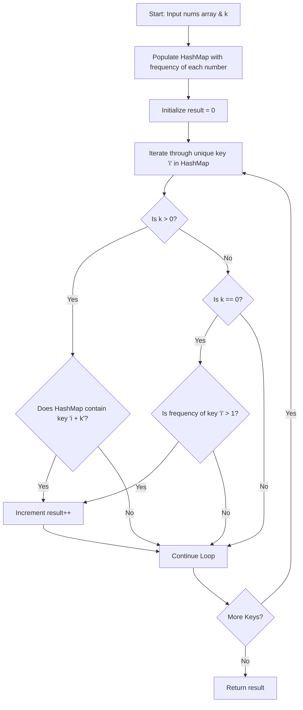

<h2><a href="https://leetcode.com/problems/k-diff-pairs-in-an-array">0000. K Diff Pairs In An Array</a></h2>

<p>Given an array of integers <code>nums</code> and an integer <code>k</code>, return <em>the number of <b>unique</b> k-diff pairs in the array</em>.</p>

<p>A <strong>k-diff</strong> pair is an integer pair <code>(nums[i], nums[j])</code>, where the following are true:</p>

<ul>
	<li><code>0 &lt;= i, j &lt; nums.length</code></li>
	<li><code>i != j</code></li>
	<li><code>|nums[i] - nums[j]| == k</code></li>
</ul>

<p><strong>Notice</strong> that <code>|val|</code> denotes the absolute value of <code>val</code>.</p>

<p>&nbsp;</p>
<p><strong class="example">Example 1:</strong></p>

<pre><strong>Input:</strong> nums = [3,1,4,1,5], k = 2
<strong>Output:</strong> 2
<strong>Explanation:</strong> There are two 2-diff pairs in the array, (1, 3) and (3, 5).
Although we have two 1s in the input, we should only return the number of <strong>unique</strong> pairs.
</pre>

<p><strong class="example">Example 2:</strong></p>

<pre><strong>Input:</strong> nums = [1,2,3,4,5], k = 1
<strong>Output:</strong> 4
<strong>Explanation:</strong> There are four 1-diff pairs in the array, (1, 2), (2, 3), (3, 4) and (4, 5).
</pre>

<p><strong class="example">Example 3:</strong></p>

<pre><strong>Input:</strong> nums = [1,3,1,5,4], k = 0
<strong>Output:</strong> 1
<strong>Explanation:</strong> There is one 0-diff pair in the array, (1, 1).
</pre>

<p>&nbsp;</p>
<p><strong>Constraints:</strong></p>

<ul>
	<li><code>1 &lt;= nums.length &lt;= 10<sup>4</sup></code></li>
	<li><code>-10<sup>7</sup> &lt;= nums[i] &lt;= 10<sup>7</sup></code></li>
	<li><code>0 &lt;= k &lt;= 10<sup>7</sup></code></li>
</ul>


---

# 🛍️ K-Diff-Pairs-In-An-Array | Explained

## Approach 1: Frequency Hash Map Strategy

### Intuition
Imagine you are an inventory manager running a warehouse, and you want to bundle pairs of products whose prices differ by exactly `$k$`. 

Checking every product against every other product takes $O(N^2)$ time—which is far too slow when dealing with thousands of items. Instead, you build a lookup catalog (a Frequency Map) recording each unique item price and how many copies of that item exist.

With this catalog ready, you simply walk through each **unique price** $x$ in your inventory:
1. **When $k > 0$ (Distinct Price Difference):** You check if the catalog contains an item priced at $x + k$. By looking only for $x + k$ (and not $x - k$), you ensure that every valid pair $(x, x + k)$ is discovered **exactly once** from its smaller element, preventing duplicate pair counts.
2. **When $k = 0$ (Identical Price Difference):** You need two items with the *exact same price* ($x - x = 0$). You ask the catalog: *"Do we have at least 2 copies of item $x$?"* If yes, you have found 1 unique valid pair $(x, x)$.

This single-pass key check eliminates unnecessary comparisons and naturally handles duplicate numbers in the array.

### Algorithm Visualized



---

### Approach

1. **Build Frequency Map:** Iterate through the input array `nums` and populate a `HashMap<Integer, Integer>` storing `element -> frequency`.
2. **Key Set Iteration:** Loop through the unique keys of the map (`map.keySet()`). Iterating over keys automatically handles uniqueness, so identical pairs are never counted twice.
3. **Evaluate Pair Conditions:**
   - **For $k > 0$:** Check if `map.containsKey(i + k)`. If true, increment `result`.
   - **For $k == 0$:** Check if `map.get(i) > 1`. If true, increment `result`.
4. **Return Result:** Return the accumulated pair count.

---

### Detailed Code Analysis

Let's dissect the implementation step by step:

* **Data Structure Selection:**
  ```java
  Map<Integer, Integer> map = new HashMap();
  ```
  A `HashMap` is chosen because it allows $O(1)$ average time complexity for insertion and lookup operations. Crucially, its key set (`map.keySet()`) contains only distinct elements, giving us deduplication for free.

* **Frequency Counting Loop:**
  ```java
  for (int num : nums)
      map.put(num, map.getOrDefault(num, 0) + 1);
  ```
  Iterates over `nums` once. `map.getOrDefault(num, 0) + 1` increments the frequency counter for each number.

* **Evaluating Pairs:**
  ```java
  for (int i : map.keySet())
      if (k > 0 && map.containsKey(i + k) || k == 0 && map.get(i) > 1)
          result++;
  ```
  - `for (int i : map.keySet())`: We iterate through **unique** values only.
  - `k > 0 && map.containsKey(i + k)`: If $k$ is positive, we test if the higher complement $i + k$ exists. Testing only for the upper bound ($i + k$) avoids counting both $(i, i+k)$ and $(i+k, i)$ as separate entities.
  - `k == 0 && map.get(i) > 1`: If $k$ is zero, two elements must be equal to form a pair. We verify that the frequency of $i$ is at least 2.
  - `result++`: Each valid match increments the pair counter by 1.

---

### Code

```java
// O(n) Time Complexity Solution using HashMap Frequency Table
class Solution {
    public int findPairs(int[] nums, int k) {
        Map<Integer, Integer> map = new HashMap<>();
        
        // Step 1: Count frequencies of each number
        for (int num : nums) {
            map.put(num, map.getOrDefault(num, 0) + 1);
        }
        
        int result = 0;
        
        // Step 2: Iterate through unique elements
        for (int i : map.keySet()) {
            if ((k > 0 && map.containsKey(i + k)) || (k == 0 && map.get(i) > 1)) {
                result++;
            }
        }
        
        return result;
    }
}
```

---

### Complexity

- **Time Complexity:** $\mathcal{O}(N)$
  - Building the frequency map takes $\mathcal{O}(N)$ time to iterate through $N$ elements.
  - Iterating over `map.keySet()` takes $\mathcal{O}(U)$ time, where $U$ is the number of unique elements ($U \le N$).
  - HashMap lookups (`containsKey` and `get`) run in $\mathcal{O}(1)$ average time.
  - Total Time Complexity is $\mathcal{O}(N)$.

- **Space Complexity:** $\mathcal{O}(N)$
  - In the worst case (where all elements in `nums` are distinct), the `HashMap` stores $N$ key-value pairs, consuming $\mathcal{O}(N)$ auxiliary memory.

---

## 🕵️‍♂️ Follow-up Questions

### 1. What if space complexity must be optimized to $\mathcal{O}(1)$ auxiliary space?
**Answer:** We can achieve $\mathcal{O}(1)$ extra space by sorting the array first ($\mathcal{O}(N \log N)$ time) and using a **Two-Pointer / Sliding Window** technique. 

We maintain two pointers, `left = 0` and `right = 1`. 
- If `nums[right] - nums[left] < k` or `left == right`, increment `right`.
- If `nums[right] - nums[left] > k`, increment `left`.
- If `nums[right] - nums[left] == k`, we found a pair! Increment `result`, advance `left`, and skip duplicate values for both pointers to avoid counting identical pairs.

### 2. How should negative values of $k$ be handled?
**Answer:** The absolute difference $|a - b|$ between two real numbers can never be negative. If $k < 0$, it is impossible to satisfy the condition $|nums[i] - nums[j]| = k$. We can immediately add a guard clause at the start of the method:
```java
if (k < 0) return 0;
```