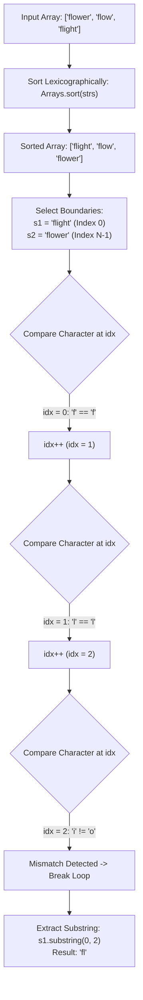

<h2><a href="https://leetcode.com/problems/longest-common-prefix">14. Longest Common Prefix</a></h2>

<p>Write a function to find the longest common prefix string amongst an array of strings.</p>

<p>If there is no common prefix, return an empty string <code>""</code>.</p>

<p>&nbsp;</p>
<p><strong class="example">Example 1:</strong></p>

<pre><strong>Input:</strong> strs = ["flower","flow","flight"]
<strong>Output:</strong> "fl"
</pre>

<p><strong class="example">Example 2:</strong></p>

<pre><strong>Input:</strong> strs = ["dog","racecar","car"]
<strong>Output:</strong> ""
<strong>Explanation:</strong> There is no common prefix among the input strings.
</pre>

<p>&nbsp;</p>
<p><strong>Constraints:</strong></p>

<ul>
	<li><code>1 &lt;= strs.length &lt;= 200</code></li>
	<li><code>0 &lt;= strs[i].length &lt;= 200</code></li>
	<li><code>strs[i]</code> consists of only lowercase English letters if it is non-empty.</li>
</ul>


---

# 🛍️ Longest-Common-Prefix | Explained

## Approach 1: Sorting and Boundary Comparison

### Intuition
Imagine arranging a stack of word cards in alphabetical order, like a dictionary. 

If you sort the words alphabetically, the words that are most dissimilar from each other will end up at the extreme ends of the list: the very first word (lexicographically smallest) and the very last word (lexicographically largest).

Because the array is sorted, any prefix shared between the **first** word and the **last** word *must* also be shared by all the words trapped in between them. Therefore, instead of comparing every single string against every other string, you only need to compare the first and last strings of the sorted array character by character.

### Algorithm Visualized



---

### Approach

1. **Lexicographical Sort:** Sort the string array using `Arrays.sort(strs)`. This puts the strings in alphabetical order.
2. **Identify Extremes:** Assign the first string `strs[0]` to `s1` and the last string `strs[strs.length - 1]` to `s2`.
3. **Character Matching:** Initialize an index pointer `idx = 0`. Iterate through both `s1` and `s2` simultaneously while comparing characters at `idx`.
4. **Terminate Comparison:** Break the loop as soon as:
   - `idx` exceeds the bounds of either string.
   - The characters at `s1.charAt(idx)` and `s2.charAt(idx)` do not match.
5. **Extract Result:** Return the slice of `s1` from index `0` up to (but not including) `idx`.

---

### Detailed Code Analysis

```java
1 class Solution {
2     public String longestCommonPrefix(String[] strs) {
3         Arrays.sort(strs);
4         String s1 = strs[0];
5         String s2 = strs[strs.length-1];
6         int idx = 0;
7         while(idx < s1.length() && idx < s2.length()){
8             if(s1.charAt(idx) == s2.charAt(idx)){
9                 idx++;
10            } else {
11                break;
12            }
13        }
14        return s1.substring(0, idx);
15    }
16 }
```

- **Line 3 (`Arrays.sort(strs);`):** Sorts the array in place. In Java, sorting an array of `Objects` (Strings) uses Timsort. String comparison relies on lexicographical order based on Unicode values.
- **Lines 4–5 (`String s1 = strs[0]; String s2 = strs[strs.length-1];`):** Stores references to the two extreme strings. `s1` represents the lexicographically smallest string, and `s2` represents the lexicographically largest.
- **Line 6 (`int idx = 0;`):** Initializes the pointer that tracks the length of the common prefix.
- **Line 7 (`while(idx < s1.length() && idx < s2.length())`):** Guard clause preventing `StringIndexOutOfBoundsException`. The comparison stops if either string runs out of characters.
- **Lines 8–12 (`if(s1.charAt(idx) == s2.charAt(idx)) ...`):** Checks if character positions match. If they match, `idx` increments to evaluate the next character position. If a mismatch is encountered, the loop immediately terminates via `break`.
- **Line 14 (`return s1.substring(0, idx);`):** Uses Java's `substring` method to extract the matched prefix from index `0` up to `idx` (exclusive). If no characters matched, `idx` remains `0`, returning `""`.

---

### Code

```java
class Solution {
    public String longestCommonPrefix(String[] strs) {
        Arrays.sort(strs);
        String s1 = strs[0];
        String s2 = strs[strs.length-1];
        int idx = 0;
        while(idx < s1.length() && idx < s2.length()){
            if(s1.charAt(idx) == s2.charAt(idx)){
                idx++;
            } else {
                break;
            }
        }
        return s1.substring(0, idx);
    }
}
```

---

### Complexity

- **Time Complexity:** $\mathcal{O}(N \cdot M \log N + M)$
  - Sorting an array of $N$ strings where each string has a maximum length of $M$ requires $\mathcal{O}(N \cdot M \log N)$ string character comparisons.
  - The `while` loop runs at most $M$ times (the length of the shortest string between `s1` and `s2`).
  - Overall time complexity is dominated by the sorting step: $\mathcal{O}(N \cdot M \log N)$.

- **Space Complexity:** $\mathcal{O}(N)$ or $\mathcal{O}(1)$ auxiliary space
  - Java's `Arrays.sort()` for object references uses **Timsort**, which requires $\mathcal{O}(N)$ temporary memory to hold reference pointers during merges.
  - Apart from the sorting algorithm's internal space, the code uses a constant number of variables (`s1`, `s2`, `idx`), requiring $\mathcal{O}(1)$ auxiliary space.

---

## 🕵️‍♂️ Follow-up Questions

### 1. How can we optimize this to $\mathcal{O}(N \cdot M)$ time complexity without sorting?
**Answer:** Sorting adds an $\mathcal{O}(\log N)$ overhead factor. We can achieve linear time $\mathcal{O}(N \cdot M)$ using **Vertical Scanning**:
- Iterate through each character index $i$ of the first string.
- Compare character $i$ across all other strings in the array.
- Return immediately when a character mismatch occurs or when any string length limit is reached.

### 2. What data structure would you use if words are added dynamically and prefix queries occur frequently?
**Answer:** Use a **Trie (Prefix Tree)** data structure. 
- Inserting $N$ words takes $\mathcal{O}(N \cdot M)$ time.
- Finding the longest common prefix involves traversing from the Trie root down child nodes until a node has more than 1 child or marks the end of a word. This allows prefix retrieval in $\mathcal{O}(M)$ time per query.