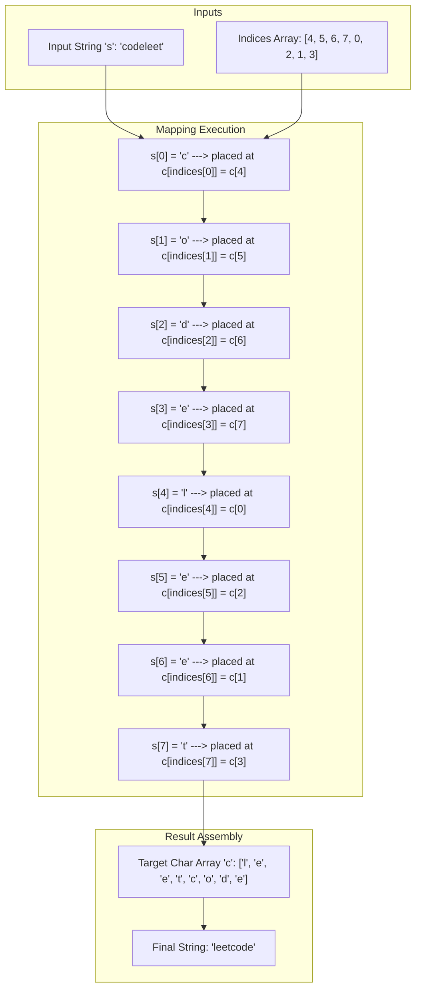

<h2><a href="https://leetcode.com/problems/shuffle-string">1528. Shuffle String</a></h2>

<p>You are given a string <code>s</code> and an integer array <code>indices</code> of the <strong>same length</strong>. The string <code>s</code> will be shuffled such that the character at the <code>i<sup>th</sup></code> position moves to <code>indices[i]</code> in the shuffled string.</p>

<p>Return <em>the shuffled string</em>.</p>

<p>&nbsp;</p>
<p><strong class="example">Example 1:</strong></p>

<pre><strong>Input:</strong> s = "codeleet", <code>indices</code> = [4,5,6,7,0,2,1,3]
<strong>Output:</strong> "leetcode"
<strong>Explanation:</strong> As shown, "codeleet" becomes "leetcode" after shuffling.
</pre>

<p><strong class="example">Example 2:</strong></p>

<pre><strong>Input:</strong> s = "abc", <code>indices</code> = [0,1,2]
<strong>Output:</strong> "abc"
<strong>Explanation:</strong> After shuffling, each character remains in its position.
</pre>

<p>&nbsp;</p>
<p><strong>Constraints:</strong></p>

<ul>
	<li><code>s.length == indices.length == n</code></li>
	<li><code>1 &lt;= n &lt;= 100</code></li>
	<li><code>s</code> consists of only lowercase English letters.</li>
	<li><code>0 &lt;= indices[i] &lt; n</code></li>
	<li>All values of <code>indices</code> are <strong>unique</strong>.</li>
</ul>


---

# 🛍️ Shuffle-String | Explained

## Approach 1: Direct Mapping via Auxiliary Character Array

### Intuition
Imagine you have a deck of cards where each card has a letter written on it, but they are out of order. Simultaneously, you are given a set of instructions telling you exactly which pocket (index) in a target card-holder each card belongs to. 

Instead of rearranging the cards in place—which requires complex swapping logic—the simplest strategy is to pick up each card one by one from the original pile and put it directly into its assigned target slot in a new, correctly sized card-holder. Once every card is placed in its designated slot, reading the slots from left to right yields the restored text.

### Algorithm Visualized



### Approach
1. **Length Retrieval & Storage Allocation**: Determine the length of the string $N$. Allocate an auxiliary character array `c` of length $N$ to act as our target placement board.
2. **Scatter Operations (Direct Placement)**: Iterate through the input string `s` from index `0` to `N - 1`. For each index `i`:
   - Retrieve the character `s.charAt(i)`.
   - Place this character into the target array at position `indices[i]`.
3. **String Reconstruction**: Convert the sorted auxiliary character array `c` into a string representation and return it.

### Detailed Code Analysis

*   **Line 4:** `int length=s.length();`
    *   Caches the length of the string to avoid repeatedly calling `.length()` inside the loop condition.
*   **Line 5:** `StringBuilder sb=new StringBuilder();`
    *   Instantiates a `StringBuilder` instance to build the final string. *(Note: This can be optimized away; see complexity section).*
*   **Line 6:** `char c[]=new char[length];`
    *   Allocates a fixed-size character array `c` of size `length`. This serves as the temporary holding space where characters are arranged in their target positions.
*   **Line 8-12:** `for(int i=0; i<length; i++) { c[indices[i]] = s.charAt(i); }`
    *   Iterates through each index `i` of the original string `s`.
    *   `s.charAt(i)` extracts the character at index `i`.
    *   `indices[i]` fetches the correct index where this character belongs in the restored string.
    *   `c[indices[i]] = ...` performs an $O(1)$ write operation into the target bucket.
*   **Line 13-14:** `sb.append(c); return sb.toString();`
    *   Appends the entire constructed character array `c` into `sb` and converts it to a immutable `String` object to return.

### Code

```java
class Solution {
    public String restoreString(String s, int[] indices) {
        
        int length = s.length();
        StringBuilder sb = new StringBuilder();
        char c[] = new char[length];
       
        for (int i = 0; i < length; i++) {
            c[indices[i]] = s.charAt(i);
        }
        
        sb.append(c);
        return sb.toString();
    }
}
```

### Complexity

- **Time Complexity:** $\mathcal{O}(N)$
  - Scanning through the string of length $N$ takes $\mathcal{O}(N)$ time.
  - Array writes `c[indices[i]]` and string index access `s.charAt(i)` both execute in $\mathcal{O}(1)$ constant time.
  - Converting the character array to a String takes $\mathcal{O}(N)$ time.
  - Overall time complexity is linear: $\mathcal{O}(N)$.

- **Space Complexity:** $\mathcal{O}(N)$
  - Memory allocated for the output character array `c` is $N$ chars.
  - The `StringBuilder` object allocates an additional internal buffer of $N$ chars.
  - Total auxiliary space is $\mathcal{O}(N)$.

---

## 🕵️‍♂️ Follow-up Questions

### 1. How can we optimize memory allocation in this implementation?
**Answer:** The `StringBuilder` object is redundant. In Java, `new String(c)` or `String.valueOf(c)` creates a string directly from a `char[]` without allocating intermediate buffers or method call overhead associated with `StringBuilder.append(char[])`.

```java
// Memory Optimized Return
return new String(c);
```

### 2. Is it possible to solve this in $\mathcal{O}(1)$ extra space?
**Answer:** In Java, because `String` objects are immutable, we must return a new `String`, requiring at least $\mathcal{O}(N)$ space for the output. However, if the input were given as a mutable `char[]`, we could achieve $\mathcal{O}(1)$ auxiliary space using **Cyclic Sort / Permutation Swapping**:

```java
// In-place placement logic if working with a mutable char array 'sArr':
for (int i = 0; i < indices.length; i++) {
    while (indices[i] != i) {
        int targetIdx = indices[i];
        
        // Swap characters
        char tempChar = sArr[i];
        sArr[i] = sArr[targetIdx];
        sArr[targetIdx] = tempChar;
        
        // Swap indices to record movement
        int tempIdx = indices[i];
        indices[i] = indices[targetIdx];
        indices[targetIdx] = tempIdx;
    }
}
```