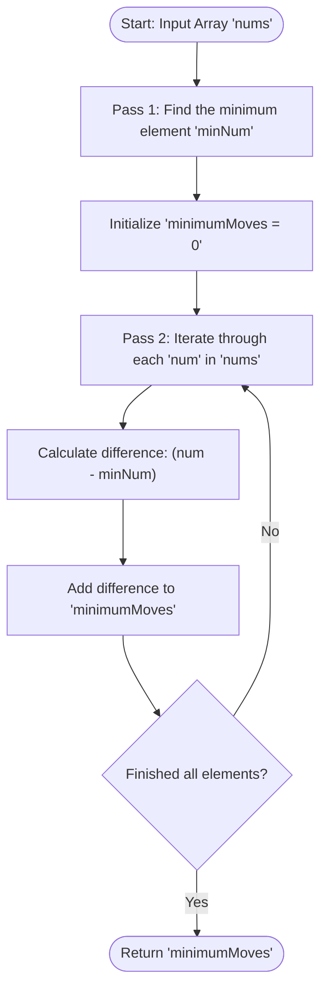

<h2><a href="https://leetcode.com/problems/minimum-moves-to-equal-array-elements">453. Minimum Moves to Equal Array Elements</a></h2>

<p>Given an integer array <code>nums</code> of size <code>n</code>, return <em>the minimum number of moves required to make all array elements equal</em>.</p>

<p>In one move, you can increment <code>n - 1</code> elements of the array by <code>1</code>.</p>

<p>&nbsp;</p>
<p><strong class="example">Example 1:</strong></p>

<pre><strong>Input:</strong> nums = [1,2,3]
<strong>Output:</strong> 3
<strong>Explanation:</strong> Only three moves are needed (remember each move increments two elements):
[1,2,3]  =&gt;  [2,3,3]  =&gt;  [3,4,3]  =&gt;  [4,4,4]
</pre>

<p><strong class="example">Example 2:</strong></p>

<pre><strong>Input:</strong> nums = [1,1,1]
<strong>Output:</strong> 0
</pre>

<p>&nbsp;</p>
<p><strong>Constraints:</strong></p>

<ul>
	<li><code>n == nums.length</code></li>
	<li><code>1 &lt;= nums.length &lt;= 10<sup>5</sup></code></li>
	<li><code>-10<sup>9</sup> &lt;= nums[i] &lt;= 10<sup>9</sup></code></li>
	<li>The answer is guaranteed to fit in a <strong>32-bit</strong> integer.</li>
</ul>


---

# 🛍️ Minimum-Moves-to-Equal-Array-Elements | Explained

## Approach 1: Mathematical Inversion (Finding Minimum Element)

### Intuition
At first glance, incrementing $n - 1$ elements by $1$ in each move seems like a complex array manipulation problem. Trying to simulate this step-by-step would be extremely inefficient because we would constantly have to pick the $n - 1$ smallest elements and increment them until all elements become equal.

The key breakthrough comes from shifting our perspective: **Relative to each other, incrementing $n - 1$ elements by $1$ is mathematically identical to decrementing $1$ element by $1$.**

Imagine $n$ towers of different heights. If you want to make all towers the same height, adding a block to every tower except the tallest one decreases the relative difference between the tallest tower and all others by $1$. This is the exact same as removing $1$ block from the tallest tower. 

Because we want all elements to end up equal using the minimum number of moves, our target height for all elements relative to each other is the height of the smallest element ($minNum$). Therefore, the total number of moves required is simply the sum of the differences between each element and the minimum element in the array.

### Algorithm Visualized



### Approach
1. **Find the Minimum Element**: Iterate through the input array `nums` to identify the absolute minimum value (`minNum`).
2. **Calculate Total Moves**: Iterate through the array a second time. For every element `num`, calculate how many decrements it would take to reach `minNum` (`num - minNum`), and accumulate this difference into `minimumMoves`.
3. **Return Result**: Return the aggregated `minimumMoves`.

### Detailed Code Analysis

Let's break down the exact Java implementation block-by-block:

* **Finding the Minimum Value (Lines 3–6)**:
  ```java
  int minNum = nums[0];
  for(int num : nums){
      minNum = Math.min(minNum , num);
  }
  ```
  - We seed `minNum` with the first element `nums[0]`.
  - We use an enhanced `for` loop to scan every `num` in `nums`.
  - `Math.min(minNum, num)` ensures that by the end of the loop, `minNum` holds the smallest integer present in the array.

* **Calculating Total Moves Needed (Lines 8–11)**:
  ```java
  int minimumMoves = 0;
  for(int num : nums){
      minimumMoves += (num - minNum);
  }
  ```
  - We initialize our accumulator variable `minimumMoves` to `0`.
  - We iterate through `nums` again. For each element `num`, the expression `(num - minNum)` measures how far `num` is above the baseline minimum.
  - Adding this difference to `minimumMoves` accounts for the moves required to bring `num` down to `minNum` (which corresponds to raising all other elements up to `num`'s original relative level).

* **Returning Result (Line 13)**:
  ```java
  return minimumMoves;
  ```
  - Returns the total accumulated moves required to equalize all array elements.

### Code

```java
class Solution {
    public int minMoves(int[] nums) {
        int minNum = nums[0];
        for (int num : nums) {
            minNum = Math.min(minNum, num);
        }

        int minimumMoves = 0;
        for (int num : nums) {
            minimumMoves += (num - minNum);
        }
        return minimumMoves;
    }
}
```

### Complexity

- **Time Complexity:** $\mathcal{O}(n)$
  - Scanning the array to find the minimum element takes $\mathcal{O}(n)$ time.
  - Accumulating the differences in the second loop takes another $\mathcal{O}(n)$ time.
  - Overall time complexity is $\mathcal{O}(n) + \mathcal{O}(n) = \mathcal{O}(n)$, where $n$ is the length of the `nums` array.

- **Space Complexity:** $\mathcal{O}(1)$
  - The algorithm operates entirely in-place without allocating dynamic data structures.
  - Memory usage is limited to a constant number of primitive integer variables (`minNum`, `minimumMoves`, `num`), resulting in $\mathcal{O}(1)$ auxiliary space.

---

## 🕵️‍♂️ Follow-up Questions

### 1. Could this problem cause integer overflow?
**Answer:** Yes. If the array is large ($n \approx 10^5$) and the elements have large differences (e.g., elements up to $10^9$), the accumulated `minimumMoves` can exceed the limit of a standard 32-bit signed integer (`Integer.MAX_VALUE` $\approx 2.14 \times 10^9$). To prevent integer overflow in production or strictly-typed environments, `minimumMoves` should be typed as a 64-bit integer (`long` in Java).

### 2. Is it possible to solve this in a single pass?
**Answer:** Yes. Mathematically, the total moves formula $\sum (nums[i] - minNum)$ can be rewritten as:
$$\text{Total Moves} = \sum(nums[i]) - (n \times minNum)$$
During a single pass, you can simultaneously calculate the total sum of all elements and track the minimum element. After the loop, you compute `sum - (nums.length * minNum)`. However, summing all elements directly in a single pass increases the risk of integer overflow early in the loop compared to summing small relative differences.