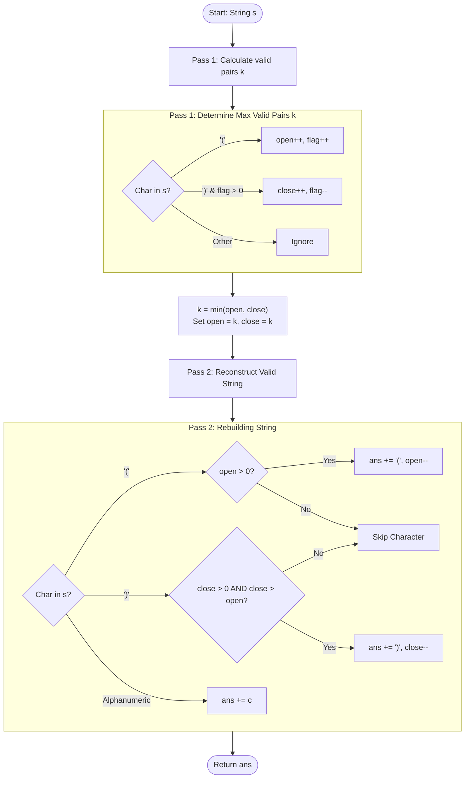

<h2><a href="https://leetcode.com/problems/minimum-remove-to-make-valid-parentheses">1249. Minimum Remove to Make Valid Parentheses</a></h2>

<p>Given a string <font face="monospace">s</font> of <code>'('</code> , <code>')'</code> and lowercase English characters.</p>

<p>Your task is to remove the minimum number of parentheses ( <code>'('</code> or <code>')'</code>, in any positions ) so that the resulting <em>parentheses string</em> is valid and return <strong>any</strong> valid string.</p>

<p>Formally, a <em>parentheses string</em> is valid if and only if:</p>

<ul>
	<li>It is the empty string, contains only lowercase characters, or</li>
	<li>It can be written as <code>AB</code> (<code>A</code> concatenated with <code>B</code>), where <code>A</code> and <code>B</code> are valid strings, or</li>
	<li>It can be written as <code>(A)</code>, where <code>A</code> is a valid string.</li>
</ul>

<p>&nbsp;</p>
<p><strong class="example">Example 1:</strong></p>

<pre><strong>Input:</strong> s = "lee(t(c)o)de)"
<strong>Output:</strong> "lee(t(c)o)de"
<strong>Explanation:</strong> "lee(t(co)de)" , "lee(t(c)ode)" would also be accepted.
</pre>

<p><strong class="example">Example 2:</strong></p>

<pre><strong>Input:</strong> s = "a)b(c)d"
<strong>Output:</strong> "ab(c)d"
</pre>

<p><strong class="example">Example 3:</strong></p>

<pre><strong>Input:</strong> s = "))(("
<strong>Output:</strong> ""
<strong>Explanation:</strong> An empty string is also valid.
</pre>

<p>&nbsp;</p>
<p><strong>Constraints:</strong></p>

<ul>
	<li><code>1 &lt;= s.length &lt;= 10<sup>5</sup></code></li>
	<li><code>s[i]</code> is either&nbsp;<code>'('</code> , <code>')'</code>, or lowercase English letter.</li>
</ul>


---

# 🛍️ Minimum-Remove-to-Make-Valid-Parentheses | Explained

## Approach 1: Two-Pass Allowance Budgeting (Counting & Selective Filtering)

### Intuition
Imagine you are managing an event with entry tickets `(` and exit tickets `)`. 
- You cannot use an exit ticket `)` unless an entry ticket `(` was already used beforehand.
- If people present exit tickets when no one has entered, those exit tickets are invalid and must be discarded immediately.
- Furthermore, if you end up with more entry tickets `(` than valid exit tickets `)`, you can only keep as many entry tickets as there are matching exit tickets.

This approach works in two passes:
1. **First Pass (Ticket Counting):** We simulate processing the string to count the maximum number of valid matching pairs, $k$. A net counter (`flag`) ensures we don't count closing brackets `)` that appear without a preceding unmatched opening bracket `(`.
2. **Second Pass (Selective Reconstruction):** We use $k$ as a "budget" for both open and close brackets. We allow up to $k$ opening brackets into our result string. For closing brackets, we only insert one if we have remaining budget *and* we have already placed more opening brackets than remaining closing brackets (guaranteeing that every closing bracket matches an opening bracket already added to our output).

### Algorithm Visualized



### Approach
1. **Pass 1 - Counting Valid Pairs:**
   - Maintain `open` (total `(` encountered), `close` (valid `)` matched), and `flag` (current depth/stack balance of open parentheses).
   - Increment `open` and `flag` when encountering `(`.
   - If encountering `)` and `flag > 0` (meaning there is an unmatched `(` available), increment `close` and decrement `flag`.
   - Calculate $k = \min(\text{open}, \text{close})$, which represents the exact number of `(` and `)` pairs that can form a valid string.

2. **Pass 2 - Rebuilding String:**
   - Reset `open = k` and `close = k`. These now serve as remaining quotas/allowances.
   - Iterate through `s` again:
     - For `(`: Append to `ans` only if `open > 0`, then decrement `open`.
     - For `)`: Append to `ans` only if `close > 0` AND `close > open`. Decrement `close`. The condition `close > open` is crucial: because `open` decreases as we place `(` characters into `ans`, `close > open` guarantees that the number of `(` already placed in `ans` is strictly greater than the number of `)` remaining to be placed.
     - For lowercase letters: Append directly to `ans`.

### Detailed Code Analysis

Let's break down the implementation line-by-line:

```cpp
class Solution {
public:
    std::string minRemoveToMakeValid(std::string s) {
        // Pass 1 variables
        int open = 0, close = 0, flag = 0;
        
        // Count total valid matching pairs
        for (char c : s) {
            if (c == '(') {
                open++;
                flag++; // Tracks current unmatched '(' depth
            } else if (c == ')' && flag > 0) {
                close++;
                flag--; // Match found; decrease unmatched '(' depth
            }
        }
        
        // k is the maximum number of balanced '(' and ')' pairs we can keep
        int k = std::min(open, close);
        
        // Fix syntax in original code: std::string ans = ; -> std::string ans = "";
        std::string ans = ""; 
        
        // Set quotas for pass 2
        open = k;
        close = k;
        
        // Pass 2: Reconstruct string with exact quotas
        for (char c : s) {
            if (c == '(') {
                if (open > 0) {
                    ans += '(';
                    open--; // Consume one '(' allowance
                }
                continue;
            }
            if (c == ')') {
                // close > open ensures an '(' has ALREADY been appended to `ans`
                if (close > 0 && close > open) {
                    ans += ')';
                    close--; // Consume one ')' allowance
                }
                continue;
            } else {
                // Regular characters (e.g., lowercase letters) are always included
                ans += c;
            }
        }
        return ans;
    }
};
```

#### Key Logic Explanations:
1. **`flag` in Pass 1:** Acts as a virtual stack depth. It prevents counting invalid `)` characters that appear before any `(` (e.g., in `")("`, `flag` remains `0` on the first character, ignoring the invalid closing bracket).
2. **`close > open` in Pass 2:** 
   - Initially, `open = k` and `close = k`.
   - When we append a `(`, `open` decreases. Thus, `open` becomes less than `close` (e.g., `open = k - 1`, `close = k`).
   - The condition `close > open` evaluates to `true`, which safely allows a `)` to be appended because we know at least one `(` has already been placed in `ans`.

### Code

```cpp
#include <string>
#include <algorithm>

class Solution {
public:
    std::string minRemoveToMakeValid(std::string s) {
        int open = 0, close = 0, flag = 0;
        for (char c : s) {
            if (c == '(') {
                open++;
                flag++;
            } else if (c == ')' && flag > 0) {
                close++;
                flag--;
            }
        }
        
        int k = std::min(open, close);
        std::string ans = "";
        open = k;
        close = k;
        for (char c : s) {
            if (c == '(') {
                if (open > 0) {
                    ans += '(';
                    open--;
                }
                continue;
            }
            if (c == ')') {
                if (close > 0 && close > open) {
                    ans += ')';
                    close--;
                }
                continue;
            } else {
                ans += c;
            }
        }
        return ans;
    }
};
```

### Complexity

- **Time Complexity:** $\mathcal{O}(N)$, where $N$ is the length of the string `s`.
  - Pass 1 iterates over the string once: $\mathcal{O}(N)$.
  - Pass 2 iterates over the string a second time: $\mathcal{O}(N)$.
  - Total time complexity is $\mathcal{O}(N) + \mathcal{O}(N) = \mathcal{O}(N)$.

- **Space Complexity:** $\mathcal{O}(N)$
  - Storing the output string `ans` takes $\mathcal{O}(N)$ memory space. Auxiliary space used for counting counters (`open`, `close`, `flag`, `k`) is $\mathcal{O}(1)$.

---

## 🕵️‍♂️ Follow-up Questions

### 1. How would you solve this in a single pass using a Stack?
**Answer:** You can iterate through the string once while storing the indices of unmatched `(` in a stack. When you encounter a `)`, if the stack is not empty, pop the top index (valid pair formed). If the stack is empty, mark the current `)` for deletion (e.g., replace it with a placeholder character like `'*'` or track its index in a hash set). After the loop, any indices remaining in the stack represent unmatched `(` and are also marked for deletion. Finally, build the output string by omitting all marked characters.

### 2. Can we solve this problem in $\mathcal{O}(1)$ auxiliary space without a stack or two pass budgeting?
**Answer:** Yes, by doing a two-step string modification directly in-place (or string traversal):
1. Traverse left-to-right to filter out invalid `)` (keep balance counter; if balance < 0, drop `)`).
2. Traverse right-to-left on the modified string to filter out invalid `(` (keep balance counter; if balance < 0, drop `(`).
3. Reverse or read left-to-right for the final result.