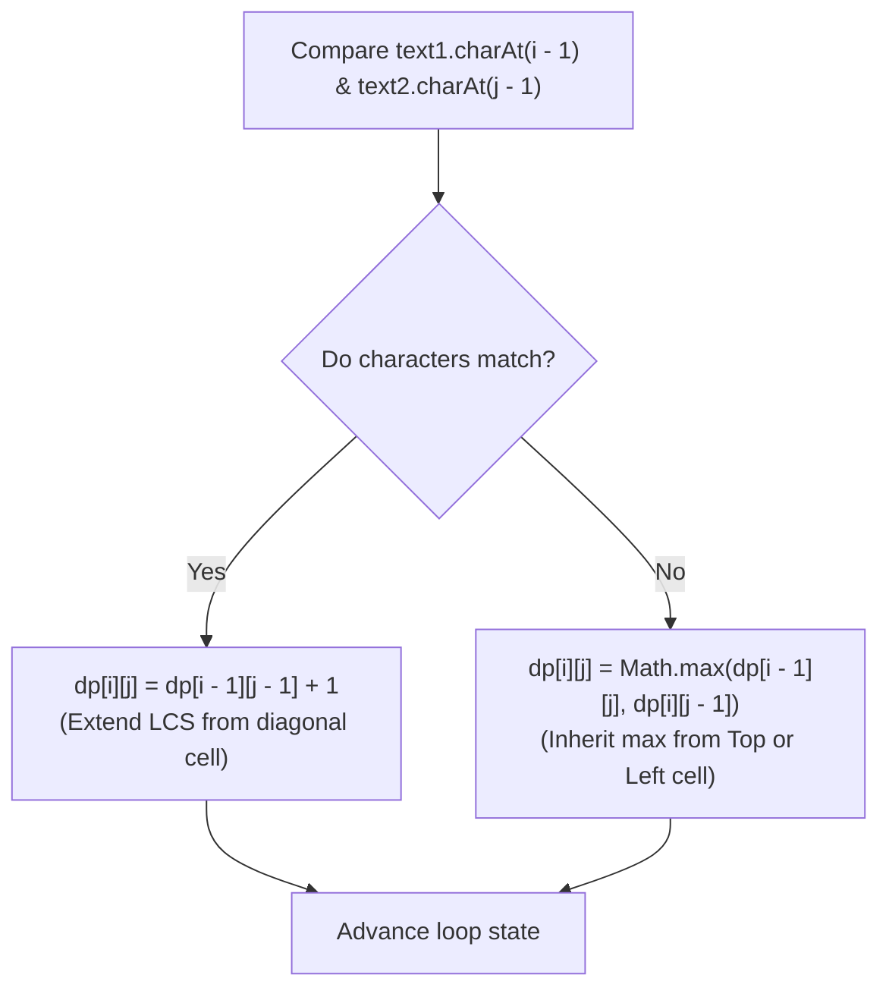

<h2><a href="https://leetcode.com/problems/longest-common-subsequence">1143. Longest Common Subsequence</a></h2>

<p>Given two strings <code>text1</code> and <code>text2</code>, return <em>the length of their longest <strong>common subsequence</strong>. </em>If there is no <strong>common subsequence</strong>, return <code>0</code>.</p>

<p>A <strong>subsequence</strong> of a string is a new string generated from the original string with some characters (can be none) deleted without changing the relative order of the remaining characters.</p>

<ul>
	<li>For example, <code>"ace"</code> is a subsequence of <code>"abcde"</code>.</li>
</ul>

<p>A <strong>common subsequence</strong> of two strings is a subsequence that is common to both strings.</p>

<p>&nbsp;</p>
<p><strong class="example">Example 1:</strong></p>

<pre><strong>Input:</strong> text1 = "abcde", text2 = "ace" 
<strong>Output:</strong> 3  
<strong>Explanation:</strong> The longest common subsequence is "ace" and its length is 3.
</pre>

<p><strong class="example">Example 2:</strong></p>

<pre><strong>Input:</strong> text1 = "abc", text2 = "abc"
<strong>Output:</strong> 3
<strong>Explanation:</strong> The longest common subsequence is "abc" and its length is 3.
</pre>

<p><strong class="example">Example 3:</strong></p>

<pre><strong>Input:</strong> text1 = "abc", text2 = "def"
<strong>Output:</strong> 0
<strong>Explanation:</strong> There is no such common subsequence, so the result is 0.
</pre>

<p>&nbsp;</p>
<p><strong>Constraints:</strong></p>

<ul>
	<li><code>1 &lt;= text1.length, text2.length &lt;= 1000</code></li>
	<li><code>text1</code> and <code>text2</code> consist of only lowercase English characters.</li>
</ul>


---

# 🛍️ Longest-Common-Subsequence | Explained

## Approach 1: Bottom-Up Dynamic Programming (2D Tabulation)

### Intuition
Imagine you are comparing two distinct timelines or DNA sequences to find shared evolutionary traits preserved in the same sequential order, even if separated by unrelated elements. 

To determine the longest common subsequence between two strings `text1` and `text2`, we can break the problem down into smaller subproblems. Consider comparing `text1` up to index `i` and `text2` up to index `j`:

1. **Match Case**: If the character at the current end of `text1` matches the character at the current end of `text2`, this character **must** form part of our optimal common subsequence. We take the optimal solution from the smaller subproblems before these characters (`dp[i-1][j-1]`) and increment it by `1`.
2. **Mismatch Case**: If the current characters do not match, the common sequence cannot include both characters at this position simultaneously. Thus, the best sequence must come from either:
   - Excluding the current character of `text1` (`dp[i-1][j]`).
   - Excluding the current character of `text2` (`dp[i][j-1]`).
   
   We choose whichever option yields the longer sequence length (`Math.max(...)`).

---

### Algorithm Visualized



---

### Approach

1. **Matrix Initialization**: Define a 2D dynamic programming grid `dp` of size `(n + 1) x (m + 1)`, where `n` and `m` are the lengths of `text1` and `text2` respectively.
   - `dp[i][j]` represents the length of the longest common subsequence using the first `i` characters of `text1` and the first `j` characters of `text2`.
2. **Base Case Handling**: The 0th row and 0th column represent scenarios where either `text1` or `text2` is an empty string. The LCS length for any comparison with an empty string is `0`. In Java, integer arrays default-initialize all cells to `0`.
3. **Table Filling**: Iterate through `i` from `1` to `n` and `j` from `1` to `m`:
   - Offset index conversion: Because DP indices are `1`-based (to account for the zero length base case), we check characters at 0-based string indices: `text1.charAt(i - 1)` and `text2.charAt(j - 1)`.
   - Apply the matching logic (diagonal transfer + 1) or mismatch logic (max of top and left neighbor cells).
4. **Result**: The answer for the complete strings `text1` and `text2` will be stored in the bottom-right cell: `dp[n][m]`.

---

### Detailed Code Analysis

* **Lines 2–3**:
  ```java
  int n = text1.length();
  int m = text2.length();
  ```
  Retrieves the lengths of both input strings to define grid boundaries and iteration limits.

* **Line 6**:
  ```java
  int[][] dp = new int[n + 1][m + 1];
  ```
  Allocates a 2D table of size `(n + 1) x (m + 1)`. The extra `+1` padding handles the empty string base cases cleanly without throwing `IndexOutOfBoundsException`.

* **Lines 8–9**:
  ```java
  for (int i = 1; i <= n; i++) {
      for (int j = 1; j <= m; j++) {
  ```
  Nested loops iterate through every subproblem combination. `i` represents the prefix length of `text1` being considered, and `j` represents the prefix length of `text2`.

* **Line 10**:
  ```java
  if (text1.charAt(i - 1) == text2.charAt(j - 1)) {
  ```
  Compares the $i$-th character of `text1` (located at 0-based index `i - 1`) with the $j$-th character of `text2` (located at 0-based index `j - 1`).

* **Line 11**:
  ```java
  dp[i][j] = dp[i - 1][j - 1] + 1;
  ```
  **Match Found**: The optimal length for prefixes of length `i` and `j` equals `1` plus the optimal length of prefixes of length `i - 1` and `j - 1` (the top-left diagonal cell).

* **Line 13**:
  ```java
  dp[i][j] = Math.max(dp[i - 1][j], dp[i][j - 1]);
  ```
  **Mismatch**: The current characters cannot pair up. The maximum sequence length is inherited from either omitting the current character of `text1` (`dp[i - 1][j]`, top cell) or omitting the current character of `text2` (`dp[i][j - 1]`, left cell).

* **Line 18**:
  ```java
  return dp[n][m];
  ```
  Returns the computed LCS length for the full inputs `text1[0...n-1]` and `text2[0...m-1]`.

---

### Code

```java
class Solution {
    public int longestCommonSubsequence(String text1, String text2) {
        int n = text1.length();
        int m = text2.length();

        int[][] dp = new int[n + 1][m + 1];

        for (int i = 1; i <= n; i++) {
            for (int j = 1; j <= m; j++) {
                if (text1.charAt(i - 1) == text2.charAt(j - 1)) {
                    dp[i][j] = dp[i - 1][j - 1] + 1;
                } else {
                    dp[i][j] = Math.max(dp[i - 1][j], dp[i][j - 1]);
                }
            }
        }

        return dp[n][m];
    }
}
```

---

### Complexity

- **Time Complexity:** $\mathcal{O}(N \times M)$
  - Where $N$ is the length of `text1` and $M$ is the length of `text2`.
  - The double `for` loops traverse every cell in the $(N+1) \times (M+1)$ table exactly once, performing $\mathcal{O}(1)$ character operations and comparisons per cell.

- **Space Complexity:** $\mathcal{O}(N \times M)$
  - Requires a 2D integer array `dp` of size $(N + 1) \times (M + 1)$ to store the subproblem states.

---

## 🕵️‍♂️ Follow-up Questions

### 1. How can we optimize the Space Complexity from $\mathcal{O}(N \times M)$ to $\mathcal{O}(\min(N, M))$?
**Answer:** Notice that filling row `i` in the `dp` table only requires values from the current row `i` and the previous row `i - 1`. 
- We can maintain just two 1D arrays of size $M + 1$: `prev` and `curr`.
- At the end of each outer loop iteration, set `prev = curr.clone()`.
- To minimize memory further, ensure the smaller string length forms the column dimension ($M = \min(\text{length}(text1), \text{length}(text2))$).

### 2. How can we reconstruct and print the actual LCS string rather than just its length?
**Answer:** Backtrack from the target cell `dp[n][m]` back to `dp[0][0]`:
- If `text1.charAt(i - 1) == text2.charAt(j - 1)`, append this character to a `StringBuilder`, and move diagonally to `(i - 1, j - 1)`.
- If they do not match, look at the adjacent neighbors `dp[i - 1][j]` and `dp[i][j - 1]` and step into whichever neighbor holds the larger DP value.
- Once reaching row 0 or column 0, reverse the accumulated `StringBuilder` to retrieve the correct character sequence.