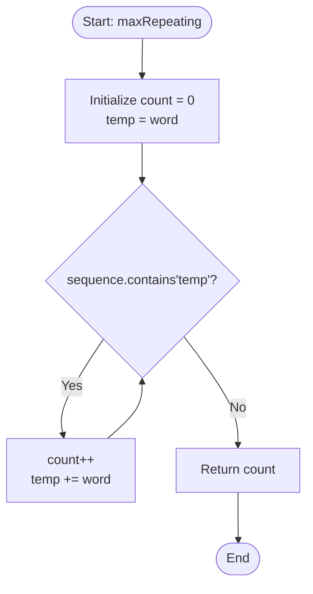

<h2><a href="https://leetcode.com/problems/maximum-repeating-substring">1668. Maximum Repeating Substring</a></h2>

<p>For a string <code>sequence</code>, a string <code>word</code> is <strong><code>k</code>-repeating</strong> if <code>word</code> concatenated <code>k</code> times is a substring of <code>sequence</code>. The <code>word</code>'s <strong>maximum <code>k</code>-repeating value</strong> is the highest value <code>k</code> where <code>word</code> is <code>k</code>-repeating in <code>sequence</code>. If <code>word</code> is not a substring of <code>sequence</code>, <code>word</code>'s maximum <code>k</code>-repeating value is <code>0</code>.</p>

<p>Given strings <code>sequence</code> and <code>word</code>, return <em>the <strong>maximum <code>k</code>-repeating value</strong> of <code>word</code> in <code>sequence</code></em>.</p>

<p>&nbsp;</p>
<p><strong class="example">Example 1:</strong></p>

<pre><strong>Input:</strong> sequence = "ababc", word = "ab"
<strong>Output:</strong> 2
<strong>Explanation: </strong>"abab" is a substring in "<u>abab</u>c".
</pre>

<p><strong class="example">Example 2:</strong></p>

<pre><strong>Input:</strong> sequence = "ababc", word = "ba"
<strong>Output:</strong> 1
<strong>Explanation: </strong>"ba" is a substring in "a<u>ba</u>bc". "baba" is not a substring in "ababc".
</pre>

<p><strong class="example">Example 3:</strong></p>

<pre><strong>Input:</strong> sequence = "ababc", word = "ac"
<strong>Output:</strong> 0
<strong>Explanation: </strong>"ac" is not a substring in "ababc". 
</pre>

<p>&nbsp;</p>
<p><strong>Constraints:</strong></p>

<ul>
	<li><code>1 &lt;= sequence.length &lt;= 100</code></li>
	<li><code>1 &lt;= word.length &lt;= 100</code></li>
	<li><code>sequence</code> and <code>word</code>&nbsp;contains only lowercase English letters.</li>
</ul>


---

# 🛍️ Maximum-Repeating-Substring | Explained

## Approach 1: Incremental String Concatenation and Search

### Intuition
Think of this problem like testing how many links you can add to a chain before it no longer fits inside a specific box. 

Here, the `sequence` is the box, and `word` is a single chain link. We start with a chain of length 1 (`temp = word`), check if it fits inside `sequence`, and if it does, we increment our counter and attach another link (`temp += word`). We repeat this process until the chain becomes too long or sequence pattern doesn't match anymore. The number of successful checks gives us the maximum repeating value $k$.

### Algorithm Visualized



### Approach
1. **Initialize State**: Maintain a counter `count = 0` to track the maximum $k$-repeating value, and set a temporary search string `temp = word`.
2. **Iterative Search**:
   - Check if `sequence` contains `temp` as a substring.
   - If it exists, increment `count` by `1` and append another copy of `word` to `temp` (making `temp` represent $k+1$ repeated words).
3. **Termination**: The loop terminates as soon as `sequence.contains(temp)` returns `false`.
4. **Return Result**: Return `count`, which represents the maximum value of $k$ for which `word` repeated $k$ times is a substring of `sequence`.

### Detailed Code Analysis

```java
class Solution {
    public int maxRepeating(String sequence, String word) {
        // Step 1: Initialize the repeat count tracker
        int count = 0;
        
        // Step 2: Set initial substring to test (k = 1)
        String temp = word;
        
        // Step 3: Continuously test if sequence contains 'word' repeated (count + 1) times
        while(sequence.contains(temp)){
            count++;        // Found valid repeating substring of length 'count'
            temp += word;   // Prepare the search string for the next repetition (k + 1)
        }
        
        // Step 4: Return the maximum valid repetition count
        return count;
    }
}
```

- **`int count = 0;`**: Variable to store the maximum $k$ value found so far.
- **`String temp = word;`**: Holds the concatenated `word` string of length $k \times \text{length}(word)$.
- **`sequence.contains(temp)`**: Under the hood in Java, `String.contains()` delegates to `String.indexOf()`. It scans `sequence` to find an exact match for `temp`.
- **`temp += word;`**: Creates a new `String` object in Java's String Pool/Heap by appending `word` to `temp`. 

### Code
```java
class Solution {
    public int maxRepeating(String sequence, String word) {
        int count = 0;
        String temp = word;
        while(sequence.contains(temp)){
            count++;
            temp += word;
        }
        return count;
    }
}
```

### Complexity

- **Time Complexity:** $\mathcal{O}(N^3 / M)$ worst-case (or $\mathcal{O}(N^2)$ given LeetCode constraints where $N, M \le 100$).
  - Let $N = \text{length}(sequence)$ and $M = \text{length}(word)$.
  - The maximum number of repetitions possible is $K = \lfloor N / M \rfloor$.
  - In iteration $k$, `temp` has length $k \cdot M$.
  - String concatenation `temp += word` takes $\mathcal{O}(k \cdot M)$ time because Java strings are immutable.
  - The `sequence.contains(temp)` call uses naive string matching internally taking up to $\mathcal{O}(N \cdot (k \cdot M))$ time.
  - Summing across all $K$ iterations: $\sum_{k=1}^{K} \mathcal{O}(N \cdot k \cdot M) = \mathcal{O}\left(N \cdot M \cdot \frac{K^2}{2}\right)$. Substituting $K = N/M$ yields $\mathcal{O}\left(\frac{N^3}{M}\right)$.
  - Given small constraints ($N \le 100$), this completes in less than a millisecond.

- **Space Complexity:** $\mathcal{O}(N)$
  - In each iteration, `temp` grows in size up to $N + M$ characters before the loop terminates.
  - Due to Java's string immutability, intermediate string allocations are created and eventually garbage collected, requiring $\mathcal{O}(N)$ extra auxiliary space.

---

## 🕵️‍♂️ Follow-up Questions (Optional)

### 1. How would you optimize this solution to $\mathcal{O}(N + M)$ Time Complexity for larger inputs?
**Answer:** 
We can solve this using the **Knuth-Morris-Pratt (KMP)** algorithm or **Dynamic Programming**:
- **Dynamic Programming Approach:** Create a DP array `dp` of size $N + 1$, where `dp[i]` represents the maximum repeating count of `word` ending at index `i` in `sequence`. Iterate through `sequence`, and whenever a substring match for `word` ends at index `i`, set `dp[i] = dp[i - M] + 1`. Track the maximum value in `dp`. This reduces time complexity to $\mathcal{O}(N \cdot M)$ or $\mathcal{O}(N)$ with KMP preprocessing.

### 2. Why is String Concatenation (`temp += word`) inside a loop usually considered an anti-pattern in Java, and how can it be improved?
**Answer:** 
Java `String` objects are immutable. Performing `temp += word` inside a loop creates a brand new `String` object in memory on every iteration, copying all previous characters. For larger strings or high iteration counts, this causes quadratic space/time overhead and heavy Garbage Collection pressure.
To optimize, we could use a `StringBuilder` or pre-build string repetitions using binary exponentiation / binary search on $k$.