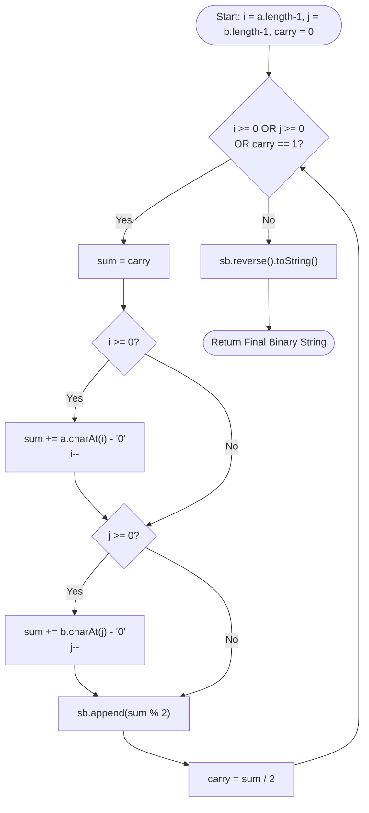

<h2><a href="https://leetcode.com/problems/add-binary">67. Add Binary</a></h2>

<p>Given two binary strings <code>a</code> and <code>b</code>, return <em>their sum as a binary string</em>.</p>

<p>&nbsp;</p>
<p><strong class="example">Example 1:</strong></p>
<pre><strong>Input:</strong> a = "11", b = "1"
<strong>Output:</strong> "100"
</pre><p><strong class="example">Example 2:</strong></p>
<pre><strong>Input:</strong> a = "1010", b = "1011"
<strong>Output:</strong> "10101"
</pre>
<p>&nbsp;</p>
<p><strong>Constraints:</strong></p>

<ul>
	<li><code>1 &lt;= a.length, b.length &lt;= 10<sup>4</sup></code></li>
	<li><code>a</code> and <code>b</code> consist&nbsp;only of <code>'0'</code> or <code>'1'</code> characters.</li>
	<li>Each string does not contain leading zeros except for the zero itself.</li>
</ul>


---

# 🛍️ Add-Binary | Explained

## Approach 1: Right-to-Left Simulation (Elementary Grade-School Math)

### Intuition
Think back to primary school when you learned to add large base-10 numbers using paper and pencil. You align the numbers on the right, add the least significant digits first, write down the result modulo 10, and carry over any value greater than 9 to the next column on the left.

Binary addition works on the exact same principles, but in base-2 instead of base-10:
* $0 + 0 = 0$ (Carry: 0)
* $1 + 0 = 1$ (Carry: 0)
* $1 + 1 = 2_{10} = 10_2$ (Result bit: 0, Carry: 1)
* $1 + 1 + 1 = 3_{10} = 11_2$ (Result bit: 1, Carry: 1)

By placing pointers at the end of both binary strings, we simulate column-by-column addition from right to left (least significant bit to most significant bit), maintaining a running `carry` variable across iterations.

---

### Algorithm Visualized



---

### Approach
1. **Initialize Pointers and Storage**:
   * Create a `StringBuilder` to accumulate output digits.
   * Initialize two pointers, `i` and `j`, set to the last indices of string `a` and string `b` respectively.
   * Initialize a `carry` integer to `0`.

2. **Iterate Right-to-Left**:
   * Execute a single `while` loop that continues as long as:
     * There are remaining characters in `a` (`i >= 0`), OR
     * There are remaining characters in `b` (`j >= 0`), OR
     * There is an unhandled `carry` bit (`carry == 1`).

3. **Process Each Bit Column**:
   * Start `sum` with the current `carry`.
   * If string `a` has bits remaining, convert character `a.charAt(i)` to its numeric integer value (`0` or `1`) using character arithmetic (`a.charAt(i) - '0'`), add it to `sum`, and decrement `i`.
   * If string `b` has bits remaining, do the same with `b.charAt(j)`, add it to `sum`, and decrement `j`.

4. **Compute New Bit and Carry**:
   * The binary digit for the current column is `sum % 2` (appended to `StringBuilder`).
   * The new carry bit for the next column is `sum / 2` (integer division).

5. **Final Reversal**:
   * Because bits were processed from right (least significant) to left (most significant), the string builder holds the result in reverse order. Reversing `sb` gives the correct binary output.

---

### Detailed Code Analysis

```java
1class Solution {
2    public String addBinary(String a, String b) {
3        StringBuilder sb=new StringBuilder();
4        int carry=0;
5        int i=a.length()-1;
6        int j=b.length()-1;
```
* **Line 3**: `StringBuilder sb = new StringBuilder();`
  * Using a mutable `StringBuilder` is critical for memory optimization. Java `String` concatenation inside loops creates $O(N)$ intermediate objects per step, leading to $O(N^2)$ time complexity. `StringBuilder.append()` operates in amortized $O(1)$ time.
* **Line 4**: `int carry = 0;`
  * Tracks the overflow bit from addition in the current position to be added to the next left position.
* **Lines 5–6**: `int i = a.length() - 1; int j = b.length() - 1;`
  * Dual pointers initialized to point to the end of each string (least significant bit position).

```java
8        while(i>=0 || j>=0 || carry==1){
9            int sum=carry;
```
* **Line 8**: `while(i>=0 || j>=0 || carry==1)`
  * Compound condition handling asymmetric string lengths seamlessly. If string `a` is longer than string `b`, the loop continues processing `a` even after `j` drops below 0. The `carry == 1` condition ensures that if addition produces a final structural overflow bit (e.g., `"11" + "1" = "100"`), an extra loop iteration runs to record the trailing carry.
* **Line 9**: `int sum = carry;`
  * Resets column sum with the accumulated `carry` value from the preceding bit addition.

```java
10            if(i>=0){
11                sum+=a.charAt(i--)-'0';
12            }
13            if(j>=0){
14                sum+=b.charAt(j--)-'0';
15            }
```
* **Lines 10–12 & 13–15**: Pointer checks and character conversion.
  * `a.charAt(i--) - '0'`: Subtracting the ASCII code of character `'0'` (48) from `'0'` (48) or `'1'` (49) cleanly yields integer `0` or `1`.
  * The post-decrement operator (`i--`) performs the operation using current index `i` and immediately shifts the pointer left for the subsequent loop iteration.

```java
16            sb.append(sum%2);
17            carry=sum/2;
18        }
```
* **Line 16**: `sb.append(sum % 2);`
  * Extracts the bit value to keep in the current binary column. `0 % 2 = 0`, `1 % 2 = 1`, `2 % 2 = 0`, `3 % 2 = 1`.
* **Line 17**: `carry = sum / 2;`
  * Computes carry bit for the next column. `0 / 2 = 0`, `1 / 2 = 0`, `2 / 2 = 1`, `3 / 2 = 1`.

```java
19            return sb.reverse().toString();
20    }
21}
```
* **Line 19**: `return sb.reverse().toString();`
  * Since operations appended LSB-first, reversing restores MSB-first standard representation before conversion to string.

---

### Code

```java
class Solution {
    public String addBinary(String a, String b) {
        StringBuilder sb = new StringBuilder();
        int carry = 0;
        int i = a.length() - 1;
        int j = b.length() - 1;
        
        while (i >= 0 || j >= 0 || carry == 1) {
            int sum = carry;
            if (i >= 0) {
                sum += a.charAt(i--) - '0';
            }
            if (j >= 0) {
                sum += b.charAt(j--) - '0';
            }
            sb.append(sum % 2);
            carry = sum / 2;
        }
        
        return sb.reverse().toString();
    }
}
```

---

### Complexity

- **Time Complexity:** $\mathcal{O}(\max(N, M))$
  * Where $N$ is `a.length()` and $M$ is `b.length()`.
  * The loop iterates at most $\max(N, M) + 1$ times. Inside the loop, all operations (character fetch, arithmetic, modulo, string builder append) run in $\mathcal{O}(1)$ time. Reversing the `StringBuilder` takes time proportional to the output length, which is $\mathcal{O}(\max(N, M))$.

- **Space Complexity:** $\mathcal{O}(\max(N, M))$
  * The `StringBuilder` stores at most $\max(N, M) + 1$ characters to hold the resulting binary string. Auxiliary memory allocation beyond the output string is $\mathcal{O}(1)$ (`carry`, `i`, `j`, `sum`).

---

## 🕵️‍♂️ Follow-up Questions

### 1. What if the input strings are too long to fit into memory or standard integer types?
**Answer:** The standard approach shown above handles arbitrary length strings up to Java's `String` allocation limits (array size limit $\approx 2^{31}-1$) because it streams through characters one at a time without converting the input into intermediate integer types like `Integer.parseInt()` or `Long.parseLong()`. For true memory-constrained stream processing (e.g., gigabyte-scale inputs), input streams could read chunks of bits from disk from right-to-left, write output directly to an inverted disk stream, and reverse the file handle post-processing.

### 2. Can bitwise operators replace arithmetic modulo (`%`) and division (`/`) operations?
**Answer:** Yes. Bitwise operations are conceptually aligned with logic gates:
* Sum bit without carry: `sum & 1` (equivalent to `sum % 2`)
* Carry bit extraction: `sum >> 1` (equivalent to `sum / 2`)
Using `sum & 1` and `sum >> 1` replaces arithmetic division with primitive bit manipulation, which micro-benchmarks slightly faster on lower-level CPU instruction pipelines.