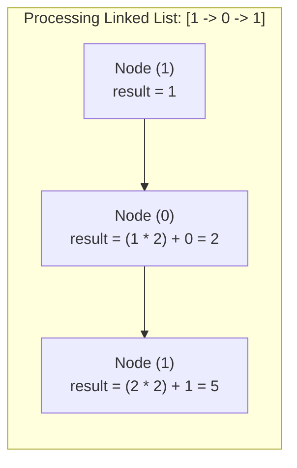

<h2><a href="https://leetcode.com/problems/convert-binary-number-in-a-linked-list-to-integer">1290. Convert Binary Number in a Linked List to Integer</a></h2>

<p>Given <code>head</code> which is a reference node to a singly-linked list. The value of each node in the linked list is either <code>0</code> or <code>1</code>. The linked list holds the binary representation of a number.</p>

<p>Return the <em>decimal value</em> of the number in the linked list.</p>

<p>The <strong>most significant bit</strong> is at the head of the linked list.</p>

<p>&nbsp;</p>
<p><strong class="example">Example 1:</strong></p>

<pre><strong>Input:</strong> head = [1,0,1]
<strong>Output:</strong> 5
<strong>Explanation:</strong> (101) in base 2 = (5) in base 10
</pre>

<p><strong class="example">Example 2:</strong></p>

<pre><strong>Input:</strong> head = [0]
<strong>Output:</strong> 0
</pre>

<p>&nbsp;</p>
<p><strong>Constraints:</strong></p>

<ul>
	<li>The Linked List is not empty.</li>
	<li>Number of nodes will not exceed <code>30</code>.</li>
	<li>Each node's value is either <code>0</code> or <code>1</code>.</li>
</ul>


---

# 🛍️ Convert-Binary-Number-in-a-Linked-List-to-Integer | Explained

## Approach 1: Iterative Base-2 Accumulation (Horner's Method)

### Intuition
When reading a number from left to right in any base, every time a new digit arrives, all previously processed digits shift one position higher in significance. 

Think of reading the decimal number `137` left to right:
1. Start with `1`.
2. Move to `3`: shift `1` one place left (`1 * 10 = 10`) and add `3` $\rightarrow 13$.
3. Move to `7`: shift `13` one place left (`13 * 10 = 130`) and add `7` $\rightarrow 137$.

The exact same logic applies to binary (base 2), but instead of multiplying by `10`, we multiply the running total by `2` before adding the next bit. This eliminates the need to know the length of the linked list in advance or compute powers of 2 backwards.

### Algorithm Visualized



### Approach
1. **Initialize Accumulator:** Set `result` to the value of the first node (`head.val`).
2. **Traverse Remaining Nodes:** Loop while `head.next != null`:
   - Advance the pointer: `head = head.next`.
   - Shift the accumulated value left by multiplying by 2, then add the current node's value: `result = result * 2 + head.val`.
3. **Return:** Once the end of the list is reached, return `result`.

### Detailed Code Analysis

- **Line 14:** `int result = head.val;`
  - Captures the most significant bit (MSB) as the starting point. Per problem constraints, the linked list is non-empty.
- **Line 15:** `while (head.next != null)`
  - Drives the traversal until the last node is reached. Checking `head.next != null` ensures we advance safely and process the subsequent node within the loop.
- **Line 16:** `head = head.next;`
  - Advances the `head` reference to the next node in the list.
- **Line 17:** `result = result * 2 + head.val;`
  - Applies Horner's rule for base 2. The previous value is multiplied by $2$ (equivalent to shifting left by 1 bit), and the current node's bit (`0` or `1`) is added.
- **Line 19:** `return result;`
  - Returns the final decimal representation.

### Code
```java
/**
 * Definition for singly-linked list.
 * public class ListNode {
 *     int val;
 *     ListNode next;
 *     ListNode() {}
 *     ListNode(int val) { this.val = val; }
 *     ListNode(int val, ListNode next) { this.val = val; this.next = next; }
 * }
 */
class Solution {
    // Intuition: multiply running result by 2, add next bit (Horner's method base 2)
    public int getDecimalValue(ListNode head) {
        int result = head.val;
        while (head.next != null) {
            head = head.next;
            result = result * 2 + head.val;
        }
        return result;
    }
}
```

### Complexity
- **Time:** $\mathcal{O}(N)$, where $N$ is the number of nodes in the linked list. The algorithm visits each node exactly once in a single pass.
- **Space:** $\mathcal{O}(1)$ auxiliary space. The calculation is done in-place using a single integer variable `result`.

---

## 🕵️‍♂️ Follow-up Questions (Optional)

1. **Can this be implemented using bitwise operators?**
   - Yes. Multiplying by 2 is equivalent to a left shift (`result << 1`), and adding a binary digit (`0` or `1`) can be written using bitwise OR (`|`). 
   - `result = (result << 1) | head.val;`
2. **What if the linked list contains more than 31 or 63 nodes (overflowing standard integer types)?**
   - A standard 32-bit `int` holds up to 31 bits (signed), and a 64-bit `long` holds up to 63 bits. For arbitrary-length binary linked lists, Java's `BigInteger` or a custom string/array-based accumulator would be required to prevent overflow.