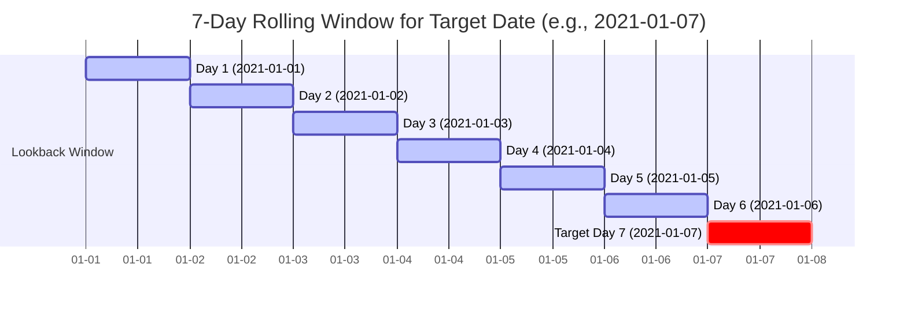

<h2><a href="https://leetcode.com/problems/restaurant-growth">1321. Restaurant Growth</a></h2>

<p>Table: <code>Customer</code></p>

<pre>+---------------+---------+
| Column Name   | Type    |
+---------------+---------+
| customer_id   | int     |
| name          | varchar |
| visited_on    | date    |
| amount        | int     |
+---------------+---------+
In SQL,(customer_id, visited_on) is the primary key for this table.
This table contains data about customer transactions in a restaurant.
visited_on is the date on which the customer with ID (customer_id) has visited the restaurant.
amount is the total paid by a customer.
</pre>

<p>&nbsp;</p>

<p>You are the restaurant owner and you want to analyze a possible expansion (there will be at least one customer every day).</p>

<p>Compute the moving average of how much the customer paid in a seven days window (i.e., current day + 6 days before). <code>average_amount</code> should be <strong>rounded to two decimal places</strong>.</p>

<p>Return the result table ordered by <code>visited_on</code> <strong>in ascending order</strong>.</p>

<p>The result format is in the following example.</p>

<p>&nbsp;</p>
<p><strong class="example">Example 1:</strong></p>

<pre><strong>Input:</strong> 
Customer table:
+-------------+--------------+--------------+-------------+
| customer_id | name         | visited_on   | amount      |
+-------------+--------------+--------------+-------------+
| 1           | Jhon         | 2019-01-01   | 100         |
| 2           | Daniel       | 2019-01-02   | 110         |
| 3           | Jade         | 2019-01-03   | 120         |
| 4           | Khaled       | 2019-01-04   | 130         |
| 5           | Winston      | 2019-01-05   | 110         | 
| 6           | Elvis        | 2019-01-06   | 140         | 
| 7           | Anna         | 2019-01-07   | 150         |
| 8           | Maria        | 2019-01-08   | 80          |
| 9           | Jaze         | 2019-01-09   | 110         | 
| 1           | Jhon         | 2019-01-10   | 130         | 
| 3           | Jade         | 2019-01-10   | 150         | 
+-------------+--------------+--------------+-------------+
<strong>Output:</strong> 
+--------------+--------------+----------------+
| visited_on   | amount       | average_amount |
+--------------+--------------+----------------+
| 2019-01-07   | 860          | 122.86         |
| 2019-01-08   | 840          | 120            |
| 2019-01-09   | 840          | 120            |
| 2019-01-10   | 1000         | 142.86         |
+--------------+--------------+----------------+
<strong>Explanation:</strong> 
1st moving average from 2019-01-01 to 2019-01-07 has an average_amount of (100 + 110 + 120 + 130 + 110 + 140 + 150)/7 = 122.86
2nd moving average from 2019-01-02 to 2019-01-08 has an average_amount of (110 + 120 + 130 + 110 + 140 + 150 + 80)/7 = 120
3rd moving average from 2019-01-03 to 2019-01-09 has an average_amount of (120 + 130 + 110 + 140 + 150 + 80 + 110)/7 = 120
4th moving average from 2019-01-04 to 2019-01-10 has an average_amount of (130 + 110 + 140 + 150 + 80 + 110 + 130 + 150)/7 = 142.86
</pre>


---

# 🛍️ Restaurant-Growth | Explained

## Approach 1: Self-Join over Rolling 7-Day Window

### Intuition
Imagine you own a restaurant and want to analyze your financial trajectory using a 7-day moving window. For any given day, you don't just look at that day's earnings—you sum up the revenue from that day and the 6 preceding days, then divide by 7 to get the daily average over that week.

To implement this without modern window functions, we create two logical copies of our customer table:
1. **Target Table (`a`)**: Represents the candidate ending dates for our 7-day window.
2. **Historical Range Table (`b`)**: Contains all individual transactions.

For each target date in `a`, we "look backward" and collect all transactions in `b` that occurred within the date interval `[visited_on - 6 days, visited_on]`. If a target date has records spanning a full 7 distinct days in its lookback window, it qualifies for our moving average output.

---

### Algorithm Visualized



---

### Approach
1. **Extract Target Anchor Dates**: Retrieve all unique `visited_on` dates from the `Customer` table using a subquery `a`. This serves as the anchor point for each potential 7-day window.
2. **Non-Equi Range Join**: Perform an `INNER JOIN` back onto the raw `Customer` table (`b`), matching records where `b.visited_on` falls between `a.visited_on - 6 days` and `a.visited_on`.
3. **Aggregate Window Data**: Group the joined dataset by anchor date `a.visited_on`.
4. **Filter Incomplete Windows**: Apply a `HAVING` clause to check `COUNT(DISTINCT b.visited_on) = 7`. This ensures that we only output dates that have a complete 7-day historical record (eliminating the first 6 days in the dataset).
5. **Calculate Metrics**: Compute the total revenue `SUM(b.amount)` and the 7-day moving average `ROUND(SUM(b.amount) / 7, 2)`.
6. **Order Output**: Sort chronologically by `a.visited_on` in ascending order.

---

### Detailed Code Analysis

```sql
SELECT
    a.visited_on,
    SUM(b.amount) AS amount,
    ROUND(SUM(b.amount) / 7, 2) AS average_amount
FROM (
    SELECT DISTINCT visited_on
    FROM Customer
) a
JOIN Customer b
  ON b.visited_on BETWEEN DATE_SUB(a.visited_on, INTERVAL 6 DAY) AND a.visited_on
GROUP BY a.visited_on
HAVING COUNT(DISTINCT b.visited_on) = 7
ORDER BY a.visited_on;
```

* **Lines 5–8 (`FROM (SELECT DISTINCT visited_on FROM Customer) a`)**: Creates a base list `a` containing every distinct day on which a customer visited. This ensures our grouping anchor consists of distinct single days rather than duplicated rows for days with multiple transactions.
* **Lines 9–10 (`JOIN Customer b ON b.visited_on BETWEEN ...`)**: Executes a range join. For every distinct anchor date `a.visited_on`, SQL attaches all customer entries from `Customer b` whose transaction date is within the closed interval `[a.visited_on - 6 days, a.visited_on]`.
* **Line 11 (`GROUP BY a.visited_on`)**: Groups all matching records in `b` under their respective anchor date `a.visited_on`.
* **Line 12 (`HAVING COUNT(DISTINCT b.visited_on) = 7`)**: Filters out any anchor date that does not have records across 7 distinct calendar days in its window. This effectively discards the warm-up period (the first 6 days of restaurant operations) where a full 7-day moving window cannot be formed.
* **Lines 1–4 (`SELECT a.visited_on, SUM(b.amount) AS amount, ...`)**: Calculates the sum of all customer amounts within the 7-day range and computes the average daily revenue rounded to two decimal places.
* **Line 13 (`ORDER BY a.visited_on`)**: Guarantees the output is presented in chronological order.

---

### Code

```sql
SELECT
    a.visited_on,
    SUM(b.amount) AS amount,
    ROUND(SUM(b.amount) / 7, 2) AS average_amount
FROM (
    SELECT DISTINCT visited_on
    FROM Customer
) a
JOIN Customer b
  ON b.visited_on BETWEEN DATE_SUB(a.visited_on, INTERVAL 6 DAY) AND a.visited_on
GROUP BY a.visited_on
HAVING COUNT(DISTINCT b.visited_on) = 7
ORDER BY a.visited_on;
```

---

### Complexity

- **Time Complexity:** $\mathcal{O}(D \cdot N + D \log D)$
  - Extracting distinct dates takes $\mathcal{O}(N \log N)$ where $N$ is the number of rows in `Customer`.
  - Let $D$ be the number of distinct dates. The range join checks transactions across a 7-day window for each distinct date, processing on average $\mathcal{O}(k)$ matching records per target date (where $k$ is the average number of transactions per 7-day window).
  - Aggregation and sorting take $\mathcal{O}(D \log D)$.

- **Space Complexity:** $\mathcal{O}(D + M)$
  - $\mathcal{O}(D)$ auxiliary memory to store unique dates for derived table `a`.
  - $\mathcal{O}(M)$ intermediate space to hold the joined result set before aggregation, where $M$ is the count of matched pairs within the 7-day rolling window.

---

## 🕵️‍♂️ Follow-up Questions

### 1. How would you optimize this query using SQL Window Functions (`OVER`)?
Using window functions avoids expensive self-joins by aggregating daily totals first, then using `SUM() OVER (...)` with a frame clause:

```sql
WITH DailySum AS (
    SELECT 
        visited_on,
        SUM(amount) AS daily_amount
    FROM Customer
    GROUP BY visited_on
)
SELECT 
    visited_on,
    SUM(daily_amount) OVER (
        ORDER BY visited_on 
        ROWS BETWEEN 6 PRECEDING AND CURRENT ROW
    ) AS amount,
    ROUND(
        AVG(daily_amount) OVER (
            ORDER BY visited_on 
            ROWS BETWEEN 6 PRECEDING AND CURRENT ROW
        ), 2
    ) AS average_amount
FROM DailySum
LIMIT 18446744073709551615 OFFSET 6;
```
*Benefits:* Reduces computational complexity from quadratic join operations down to a linear $\mathcal{O}(N \log N)$ scan and sort.

### 2. What if there are missing dates (gaps in the sequence where no customers visited)?
The `BETWEEN DATE_SUB(...)` approach handles date gaps by physically looking back 6 calendar days, but `COUNT(DISTINCT b.visited_on) = 7` will filter out windows that have inactive days. 

If requirement dictates treating missing days as `$0` revenue rather than skipping them, you must construct a continuous Date Spine (using a recursive CTE or calendar table) and `LEFT JOIN` the aggregated sales data onto it.