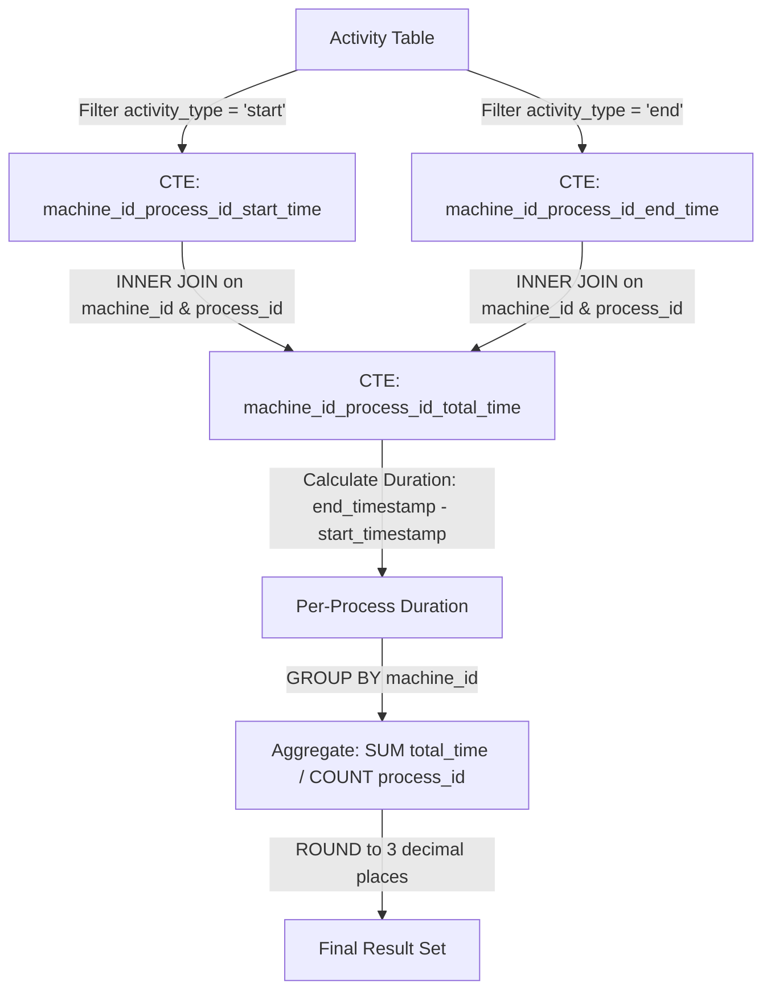

<h2><a href="https://leetcode.com/problems/average-time-of-process-per-machine">1661. Average Time of Process per Machine</a></h2>

<p>Table: <code>Activity</code></p>

<pre>+----------------+---------+
| Column Name    | Type    |
+----------------+---------+
| machine_id     | int     |
| process_id     | int     |
| activity_type  | enum    |
| timestamp      | float   |
+----------------+---------+
The table shows the user activities for a factory website.
(machine_id, process_id, activity_type) is the primary key (combination of columns with unique values) of this table.
machine_id is the ID of a machine.
process_id is the ID of a process running on the machine with ID machine_id.
activity_type is an ENUM (category) of type ('start', 'end').
timestamp is a float representing the current time in seconds.
'start' means the machine starts the process at the given timestamp and 'end' means the machine ends the process at the given timestamp.
The `start` timestamp will always be less than or equal to the `end` timestamp for every `(machine_id, process_id)` pair.
It is guaranteed that each (machine_id, process_id) pair has a 'start' and 'end' timestamp.
</pre>

<p>&nbsp;</p>

<p>There is a factory website that has several machines each running the <strong>same number of processes</strong>. Write a solution&nbsp;to find the <strong>average time</strong> each machine takes to complete a process.</p>

<p>The time to complete a process is the <code>'end' timestamp</code> minus the <code>'start' timestamp</code>. The average time is calculated by the total time to complete every process on the machine divided by the number of processes that were run.</p>

<p>The resulting table should have the <code>machine_id</code> along with the <strong>average time</strong> as <code>processing_time</code>, which should be <strong>rounded to 3 decimal places</strong>.</p>

<p>Return the result table in <strong>any order</strong>.</p>

<p>The result format is in the following example.</p>

<p>&nbsp;</p>
<p><strong class="example">Example 1:</strong></p>

<pre><strong>Input:</strong> 
Activity table:
+------------+------------+---------------+-----------+
| machine_id | process_id | activity_type | timestamp |
+------------+------------+---------------+-----------+
| 0          | 0          | start         | 0.712     |
| 0          | 0          | end           | 1.520     |
| 0          | 1          | start         | 3.140     |
| 0          | 1          | end           | 4.120     |
| 1          | 0          | start         | 0.550     |
| 1          | 0          | end           | 1.550     |
| 1          | 1          | start         | 0.430     |
| 1          | 1          | end           | 1.420     |
| 2          | 0          | start         | 4.100     |
| 2          | 0          | end           | 4.512     |
| 2          | 1          | start         | 2.500     |
| 2          | 1          | end           | 5.000     |
+------------+------------+---------------+-----------+
<strong>Output:</strong> 
+------------+-----------------+
| machine_id | processing_time |
+------------+-----------------+
| 0          | 0.894           |
| 1          | 0.995           |
| 2          | 1.456           |
+------------+-----------------+
<strong>Explanation:</strong> 
There are 3 machines running 2 processes each.
Machine 0's average time is ((1.520 - 0.712) + (4.120 - 3.140)) / 2 = 0.894
Machine 1's average time is ((1.550 - 0.550) + (1.420 - 0.430)) / 2 = 0.995
Machine 2's average time is ((4.512 - 4.100) + (5.000 - 2.500)) / 2 = 1.456
</pre>


---

# 🛍️ Average-Time-of-Process-per-Machine | Explained

## Approach 1: CTE-Based Event Separation & Self-Join Aggregation

### Intuition
Imagine a factory logbook where workers stamp a card when a process starts and stamp it again when it finishes. All these stamps are written sequentially into a single log file (`Activity`). 

To find out how long each process takes on a specific machine, we need to match the "start" stamp with the "end" stamp for that exact machine and process pair. 

By splitting the single log into two separate stacks—one stack containing only "start" timestamps and another containing only "end" timestamps—we can align them side-by-side using the `machine_id` and `process_id`. Subtracting the start time from the end time gives us the duration for each individual process. Finally, grouping all durations by machine allows us to calculate the average processing time per machine.

### Algorithm Visualized



---

### Approach
1. **Filter Start Events (`machine_id_process_id_start_time`)**: Create a Common Table Expression (CTE) to extract only rows where `activity_type` is `'start'`.
2. **Filter End Events (`machine_id_process_id_end_time`)**: Create a second CTE to extract only rows where `activity_type` is `'end'`.
3. **Match Start and End Timestamps (`machine_id_process_id_total_time`)**: Perform an `INNER JOIN` between the start CTE and end CTE on composite key `(machine_id, process_id)`. Calculate the process duration using `a2.timestamp - a1.timestamp`.
4. **Aggregate per Machine**: Group the results by `machine_id`. Calculate the arithmetic mean of process durations manually using `SUM(total_time) / COUNT(process_id)`.
5. **Format Result**: Cast the average result to numeric and round it to 3 decimal places using `ROUND(..., 3)` as required by the specification. Sort the final output by `machine_id`.

---

### Detailed Code Analysis

#### CTE 1: Extracting Start Events
```sql
WITH machine_id_process_id_start_time AS (
    SELECT a.machine_id AS machine_id, a.process_id AS process_id, a.timestamp AS timestamp
    FROM Activity a
    WHERE a.activity_type IN ('start')
    ORDER BY a.process_id ASC
),
```
* **Purpose**: Isolate start records.
* **Mechanism**: Filters the `Activity` table for `activity_type = 'start'`. While `ORDER BY a.process_id ASC` inside a CTE is generally redundant for execution engines, it explicitly sorts intermediate rows by `process_id`.

#### CTE 2: Extracting End Events
```sql
machine_id_process_id_end_time AS (
    SELECT a.machine_id AS machine_id, a.process_id AS process_id, a.timestamp AS timestamp
    FROM Activity a
    WHERE a.activity_type IN ('end')
    ORDER BY a.process_id ASC
),
```
* **Purpose**: Isolate end records.
* **Mechanism**: Works identically to CTE 1, but filters for `activity_type = 'end'`.

#### CTE 3: Calculating Per-Process Run Times
```sql
machine_id_process_id_total_time AS (
    SELECT a1.machine_id AS machine_id, a1.process_id AS process_id, a2.timestamp - a1.timestamp AS total_time
    FROM machine_id_process_id_start_time a1
    INNER JOIN machine_id_process_id_end_time a2
    ON a1.machine_id = a2.machine_id AND a1.process_id = a2.process_id
)
```
* **Purpose**: Join start and end records for identical processes on identical machines and calculate time differences.
* **Mechanism**:
  * `a1` represents start events; `a2` represents end events.
  * `a1.machine_id = a2.machine_id AND a1.process_id = a2.process_id` ensures matching pairs.
  * `a2.timestamp - a1.timestamp AS total_time` computes duration per process run.

#### Final Aggregation Query
```sql
SELECT a.machine_id AS machine_id, ROUND(CAST(SUM(a.total_time)/COUNT(a.process_id) AS numeric), 3) AS processing_time
FROM machine_id_process_id_total_time a
GROUP BY a.machine_id
ORDER BY a.machine_id ASC
```
* **Purpose**: Compute overall average time per machine and format numeric output.
* **Mechanism**:
  * `GROUP BY a.machine_id`: Groups process durations by machine.
  * `SUM(a.total_time) / COUNT(a.process_id)`: Calculates the average process duration (equivalent to `AVG(a.total_time)`).
  * `CAST(... AS numeric)`: Converts the calculated floating-point value to a precise `numeric` type required by dialect-specific `ROUND()` functions (such as PostgreSQL).
  * `ROUND(..., 3)`: Truncates/rounds the output to 3 decimal places.
  * `ORDER BY a.machine_id ASC`: Ensures machine results are returned in ascending order.

---

### Code

```sql
WITH machine_id_process_id_start_time AS (
    SELECT a.machine_id AS machine_id, a.process_id AS process_id, a.timestamp AS timestamp
    FROM Activity a
    WHERE a.activity_type IN ('start')
    ORDER BY a.process_id ASC
),
machine_id_process_id_end_time AS (
    SELECT a.machine_id AS machine_id, a.process_id AS process_id, a.timestamp AS timestamp
    FROM Activity a
    WHERE a.activity_type IN ('end')
    ORDER BY a.process_id ASC
),
machine_id_process_id_total_time AS (
    SELECT a1.machine_id AS machine_id, a1.process_id AS process_id, a2.timestamp - a1.timestamp AS total_time
    FROM machine_id_process_id_start_time a1
    INNER JOIN machine_id_process_id_end_time a2
    ON a1.machine_id = a2.machine_id AND a1.process_id = a2.process_id
)

SELECT a.machine_id AS machine_id, ROUND(CAST(SUM(a.total_time)/COUNT(a.process_id) AS numeric), 3) AS processing_time
FROM machine_id_process_id_total_time a
GROUP BY a.machine_id
ORDER BY a.machine_id ASC
```

---

### Complexity

- **Time Complexity:** 
  - **Filtering (CTE 1 & 2):** $\mathcal{O}(N)$ scan over $N$ rows of the `Activity` table.
  - **Joining (CTE 3):** $\mathcal{O}(N \log N)$ if sorting/indexes are used to perform the join on `(machine_id, process_id)`, or $\mathcal{O}(N)$ using hash join strategies.
  - **Aggregation (Final Query):** $\mathcal{O}(M \log M)$ where $M$ is the number of distinct `machine_id`s due to `GROUP BY` and `ORDER BY`.
  - **Overall Time Complexity:** $\mathcal{O}(N \log N)$ dominated by intermediate sorting and join operations.

- **Space Complexity:** 
  - $\mathcal{O}(N)$ auxiliary space required to store temporary CTE datasets (`start_time`, `end_time`, and `total_time`) in memory/disk during query execution.

---

## 🕵️‍♂️ Follow-up Questions

### 1. How could this query be optimized to eliminate intermediate CTEs and joins?
**Answer:** We can optimize execution using **Conditional Aggregation**. Instead of joining tables, we negate the `start` timestamps (multiply by `-1`) and keep `end` timestamps positive. Then, we average these adjusted timestamps directly in a single pass:

```sql
SELECT 
    machine_id,
    ROUND(
        AVG(CASE WHEN activity_type = 'end' THEN timestamp ELSE -timestamp END)::numeric * 2, 
        3
    ) AS processing_time
FROM Activity
GROUP BY machine_id;
```
*(Note: Multiplying by 2 accounts for the total duration split across twice as many process event rows).*

Alternatively, using standard conditional aggregation:
```sql
SELECT 
    machine_id,
    ROUND(
        AVG(CASE WHEN activity_type = 'end' THEN timestamp END) - 
        AVG(CASE WHEN activity_type = 'start' THEN timestamp END)::numeric, 
        3
    ) AS processing_time
FROM Activity
GROUP BY machine_id;
```

### 2. Why did we explicitly use `SUM(total_time) / COUNT(process_id)` instead of `AVG(total_time)`?
**Answer:** Functionally, `SUM(total_time) / COUNT(process_id)` and `AVG(total_time)` yield identical mathematical outcomes when no `NULL` values are present. However, manual division allows precise explicit control over data type promotion (like casting dividend vs divisor) to avoid integer division issues in standard SQL databases like SQL Server or PostgreSQL prior to rounding.