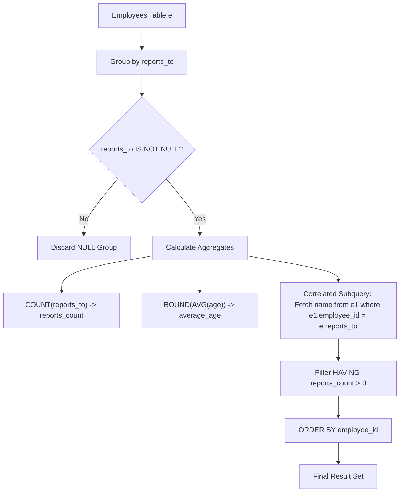

<h2><a href="https://leetcode.com/problems/the-number-of-employees-which-report-to-each-employee">1731. The Number of Employees Which Report to Each Employee</a></h2>

<p>Table: <code>Employees</code></p>

<pre>+-------------+----------+
| Column Name | Type     |
+-------------+----------+
| employee_id | int      |
| name        | varchar  |
| reports_to  | int      |
| age         | int      |
+-------------+----------+
employee_id is the column with unique values for this table.
This table contains information about the employees and the id of the manager they report to. Some employees do not report to anyone (reports_to is null). 
</pre>

<p>&nbsp;</p>

<p>For this problem, we will consider a <strong>manager</strong> an employee who has at least 1 other employee reporting to them.</p>

<p>Write a solution to report the ids and the names of all <strong>managers</strong>, the number of employees who report <strong>directly</strong> to them, and the average age of the reports rounded to the nearest integer.</p>

<p>Return the result table ordered by <code>employee_id</code>.</p>

<p>The&nbsp;result format is in the following example.</p>

<p>&nbsp;</p>
<p><strong class="example">Example 1:</strong></p>

<pre><strong>Input:</strong> 
Employees table:
+-------------+---------+------------+-----+
| employee_id | name    | reports_to | age |
+-------------+---------+------------+-----+
| 9           | Hercy   | null       | 43  |
| 6           | Alice   | 9          | 41  |
| 4           | Bob     | 9          | 36  |
| 2           | Winston | null       | 37  |
+-------------+---------+------------+-----+
<strong>Output:</strong> 
+-------------+-------+---------------+-------------+
| employee_id | name  | reports_count | average_age |
+-------------+-------+---------------+-------------+
| 9           | Hercy | 2             | 39          |
+-------------+-------+---------------+-------------+
<strong>Explanation:</strong> Hercy has 2 people report directly to him, Alice and Bob. Their average age is (41+36)/2 = 38.5, which is 39 after rounding it to the nearest integer.
</pre>

<p><strong class="example">Example 2:</strong></p>

<pre><strong>Input:</strong> 
Employees table:
+-------------+---------+------------+-----+ 
| employee_id | name &nbsp; &nbsp;| reports_to | age |
|-------------|---------|------------|-----|
| 1 &nbsp; &nbsp; &nbsp; &nbsp; &nbsp; | Michael | null &nbsp; &nbsp; &nbsp; | 45 &nbsp;|
| 2 &nbsp; &nbsp; &nbsp; &nbsp; &nbsp; | Alice &nbsp; | 1 &nbsp; &nbsp; &nbsp; &nbsp; &nbsp;| 38 &nbsp;|
| 3 &nbsp; &nbsp; &nbsp; &nbsp; &nbsp; | Bob &nbsp; &nbsp; | 1 &nbsp; &nbsp; &nbsp; &nbsp; &nbsp;| 42 &nbsp;|
| 4 &nbsp; &nbsp; &nbsp; &nbsp; &nbsp; | Charlie | 2 &nbsp; &nbsp; &nbsp; &nbsp; &nbsp;| 34 &nbsp;|
| 5 &nbsp; &nbsp; &nbsp; &nbsp; &nbsp; | David &nbsp; | 2 &nbsp; &nbsp; &nbsp; &nbsp; &nbsp;| 40 &nbsp;|
| 6 &nbsp; &nbsp; &nbsp; &nbsp; &nbsp; | Eve &nbsp; &nbsp; | 3 &nbsp; &nbsp; &nbsp; &nbsp; &nbsp;| 37 &nbsp;|
| 7 &nbsp; &nbsp; &nbsp; &nbsp; &nbsp; | Frank &nbsp; | null &nbsp; &nbsp; &nbsp; | 50 &nbsp;|
| 8 &nbsp; &nbsp; &nbsp; &nbsp; &nbsp; | Grace &nbsp; | null &nbsp; &nbsp; &nbsp; | 48 &nbsp;|
+-------------+---------+------------+-----+ 
<strong>Output:</strong> 
+-------------+---------+---------------+-------------+
| employee_id | name &nbsp; &nbsp;| reports_count | average_age |
| ----------- | ------- | ------------- | ----------- |
| 1 &nbsp; &nbsp; &nbsp; &nbsp; &nbsp; | Michael | 2 &nbsp; &nbsp; &nbsp; &nbsp; &nbsp; &nbsp; | 40 &nbsp; &nbsp; &nbsp; &nbsp; &nbsp;|
| 2 &nbsp; &nbsp; &nbsp; &nbsp; &nbsp; | Alice &nbsp; | 2 &nbsp; &nbsp; &nbsp; &nbsp; &nbsp; &nbsp; | 37 &nbsp; &nbsp; &nbsp; &nbsp; &nbsp;|
| 3 &nbsp; &nbsp; &nbsp; &nbsp; &nbsp; | Bob &nbsp; &nbsp; | 1 &nbsp; &nbsp; &nbsp; &nbsp; &nbsp; &nbsp; | 37 &nbsp; &nbsp; &nbsp; &nbsp; &nbsp;|
+-------------+---------+---------------+-------------+

</pre>


---

# 🛍️ The-Number-of-Employees-Which-Report-to-Each-Employee | Explained

## Approach 1: Group By Manager ID with Correlated Scalar Subquery

### Intuition
Imagine a company organizational directory where each row represents an employee and lists their direct manager's ID. To find manager metrics, we can invert our focus: group all employees by their manager (`reports_to`), count how many people are in each group, and calculate their average age. 

Once we have the aggregated metrics for each manager ID, we perform a target lookup back into the main directory to fetch the manager's actual name using their ID.

### Algorithm Visualized



### Approach
1. **Grouping**: Group the `employees` table (`e`) by the `reports_to` column. This gathers all direct reports together under their respective manager's ID.
2. **Aggregation**:
   - Compute `COUNT(reports_to)` to determine the number of direct reports (`reports_count`).
   - Compute `ROUND(AVG(age))` to calculate the average age of those direct reports rounded to the nearest integer.
3. **Correlated Subquery Lookup**: For each distinct manager group, run a subquery against a second alias of the table (`e1`) matching `e1.employee_id = e.reports_to` to retrieve the manager's `name`.
4. **Filtering**: Use `HAVING reports_count > 0` to filter out any group where `reports_to` was `NULL` (employees who don't report to anyone).
5. **Sorting**: Sort the final result set by `employee_id` in ascending order.

### Detailed Code Analysis

```sql
SELECT 
  reports_to AS employee_id, 
  (
    SELECT 
      name 
    FROM 
      employees e1 
    WHERE 
      e.reports_to = e1.employee_id 
  ) AS name, 
  COUNT(reports_to) AS reports_count, 
  ROUND(
    AVG(age)
  ) AS average_age 
FROM 
  employees e 
GROUP BY 
  reports_to 
HAVING 
  reports_count > 0 
ORDER BY 
  employee_id
```

- `reports_to AS employee_id`: Renames the grouping key `reports_to` to `employee_id` in the final output to represent the manager's ID.
- `(SELECT name FROM employees e1 WHERE e.reports_to = e1.employee_id) AS name`: A scalar subquery that runs per grouped row. It searches the `employees` table (`e1`) for the row where `employee_id` matches the current group's `reports_to` value, returning the manager's `name`.
- `COUNT(reports_to) AS reports_count`: Aggregates the total number of non-null `reports_to` entries in the group, representing the total direct reports.
- `ROUND(AVG(age)) AS average_age`: Computes the mean age of the employees within the group and rounds it to $0$ decimal places (the nearest integer).
- `FROM employees e GROUP BY reports_to`: Defines the source table and partitions the dataset by `reports_to`.
- `HAVING reports_count > 0`: Filters out groups where `reports_to` is `NULL`. `COUNT(NULL)` yields $0$, so this condition successfully eliminates non-manager groups.
- `ORDER BY employee_id`: Sorts the resulting table by the manager's ID in ascending order as required by the problem statement.

### Code

```sql
SELECT 
  reports_to AS employee_id, 
  (
    SELECT 
      name 
    FROM 
      employees e1 
    WHERE 
      e.reports_to = e1.employee_id 
  ) AS name, 
  COUNT(reports_to) AS reports_count, 
  ROUND(
    AVG(age)
  ) AS average_age 
FROM 
  employees e 
GROUP BY 
  reports_to 
HAVING 
  reports_count > 0 
ORDER BY 
  employee_id
```

### Complexity

- **Time Complexity:** $\mathcal{O}(N \log N + M \cdot K)$
  - Grouping $N$ employee rows takes $\mathcal{O}(N \log N)$ or $\mathcal{O}(N)$ depending on whether hash grouping or sort grouping is used.
  - Executing the scalar subquery for $M$ distinct managers takes $\mathcal{O}(M \cdot K)$, where $K$ is the lookup time per manager (if `employee_id` is indexed, $K = \mathcal{O}(1)$; otherwise $K = \mathcal{O}(N)$).
  - Sorting $M$ resulting manager rows takes $\mathcal{O}(M \log M)$.

- **Space Complexity:** $\mathcal{O}(M)$
  - Database engine creates intermediate hash tables or sort buffers proportional to $M$ ( number of unique managers with at least one direct report) to store grouped aggregate values.

---

## 🕵️‍♂️ Follow-up Questions

### 1. How can this query be rewritten to avoid correlated subqueries and improve query engine efficiency?
**Answer:** A standard `INNER JOIN` (Self-Join) is generally preferred over a correlated subquery in production databases because it allows the query optimizer to choose efficient join algorithms (such as Hash Join or Index Nested Loop Join).

```sql
SELECT 
    m.employee_id,
    m.name,
    COUNT(e.employee_id) AS reports_count,
    ROUND(AVG(e.age)) AS average_age
FROM Employees e
JOIN Employees m ON e.reports_to = m.employee_id
GROUP BY m.employee_id, m.name
ORDER BY m.employee_id;
```

### 2. What happens if a manager's direct reports have NULL values in their `age` column?
**Answer:** SQL aggregate functions like `AVG()` automatically ignore `NULL` values when computing averages. However, if all direct reports under a manager have `NULL` ages, `AVG(age)` evaluates to `NULL`, and `ROUND(NULL)` returns `NULL`.