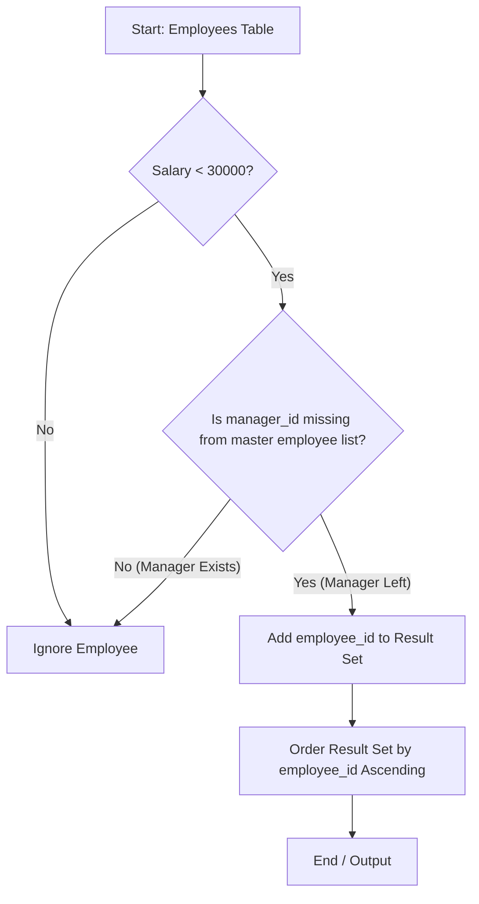

<h2><a href="https://leetcode.com/problems/employees-whose-manager-left-the-company">1978. Employees Whose Manager Left the Company</a></h2>

<p>Table: <code>Employees</code></p>

<pre>+-------------+----------+
| Column Name | Type     |
+-------------+----------+
| employee_id | int      |
| name        | varchar  |
| manager_id  | int      |
| salary      | int      |
+-------------+----------+
In SQL, employee_id is the primary key for this table.
This table contains information about the employees, their salary, and the ID of their manager. Some employees do not have a manager (manager_id is null). 
</pre>

<p>&nbsp;</p>

<p>Find the IDs of the employees whose salary is strictly less than <code>$30000</code> and whose manager left the company. When a manager leaves the company, their information is deleted from the <code>Employees</code> table, but the reports still have their <code>manager_id</code> set to the manager that left.</p>

<p>Return the result table ordered by <code>employee_id</code>.</p>

<p>The result format is in the following example.</p>

<p>&nbsp;</p>
<p><strong class="example">Example 1:</strong></p>

<pre><strong>Input: </strong> 
Employees table:
+-------------+-----------+------------+--------+
| employee_id | name      | manager_id | salary |
+-------------+-----------+------------+--------+
| 3           | Mila      | 9          | 60301  |
| 12          | Antonella | null       | 31000  |
| 13          | Emery     | null       | 67084  |
| 1           | Kalel     | 11         | 21241  |
| 9           | Mikaela   | null       | 50937  |
| 11          | Joziah    | 6          | 28485  |
+-------------+-----------+------------+--------+
<strong>Output:</strong> 
+-------------+
| employee_id |
+-------------+
| 11          |
+-------------+

<strong>Explanation:</strong> 
The employees with a salary less than $30000 are 1 (Kalel) and 11 (Joziah).
Kalel's manager is employee 11, who is still in the company (Joziah).
Joziah's manager is employee 6, who left the company because there is no row for employee 6 as it was deleted.
</pre>


---

# 🛍️ Employees-Whose-Manager-Left-the-Company | Explained

## Approach 1: Subquery Filtering using `NOT IN`

### Intuition
Imagine you are an HR auditor looking through physical employee records. You hold a master roster of everyone currently working at the company. To find employees left stranded without a manager, you pull out records of employees who earn less than $30,000. For each of these low-salary employees, you look at their manager's ID badge number and try to find that badge number on the master roster. If the manager's badge number is completely missing from the master roster, that manager has left the company, and this employee needs to be reported.

### Algorithm Visualized



### Approach
1. **Filter Low Salary**: Scan the `Employees` table to isolate employees whose `salary` is strictly less than `$30,000`.
2. **Subquery Master List**: Form an internal list (subquery) containing all valid `employee_id`s currently present in the `Employees` table.
3. **Manager Check**: For each candidate low-salary employee, check if their `manager_id` exists in the subquery master list using the `NOT IN` predicate.
   - If `manager_id` is missing from the subquery result, the manager has left the company.
   - If `manager_id` is `NULL`, SQL three-valued logic renders `NULL NOT IN (...)` as `UNKNOWN`, which safely filters out employees who never had a manager assigned.
4. **Ordering**: Sort the resulting `employee_id` list in ascending numerical order as required.

### Detailed Code Analysis

```sql
SELECT employee_id
FROM Employees
WHERE salary < 30000 AND manager_id NOT IN (
    SELECT employee_id
    FROM employees
)
ORDER BY employee_id;
```

- **Lines 1–2 (`SELECT employee_id FROM Employees`)**: Specifies that we only want to retrieve the `employee_id` field from the primary `Employees` table instance.
- **Line 3 (`WHERE salary < 30000`)**: Filters out any employee earning $30,000 or more immediately, reducing the number of outer rows that need manager validation.
- **Lines 3–7 (`AND manager_id NOT IN (SELECT employee_id FROM employees)`)**: 
  - The inner subquery `SELECT employee_id FROM employees` executes to generate the set of all existing employee IDs.
  - The `NOT IN` operator checks if the candidate's `manager_id` is absent from that set.
- **Line 8 (`ORDER BY employee_id;`)**: Ensures the final output is sorted in ascending order by `employee_id`.

### Code

```sql
-- Query to find employees earning < $30,000 whose manager has left the company
SELECT employee_id
FROM Employees
WHERE salary < 30000 
  AND manager_id NOT IN (
    SELECT employee_id
    FROM Employees
  )
ORDER BY employee_id;
```

### Complexity

- **Time Complexity:** 
  - **Worst Case:** $\mathcal{O}(N^2)$ if the Database Management System (DBMS) performs a full table scan for every row in the subquery without index acceleration.
  - **Optimized Case:** $\mathcal{O}(N \log N)$ or $\mathcal{O}(N)$ when `employee_id` is indexed (such as a Primary Key). The query optimizer can use an index lookup or hash semi-join to evaluate `NOT IN`. Sorting the final $K$ filtered records takes $\mathcal{O}(K \log K)$ time.

- **Space Complexity:** $\mathcal{O}(N)$ to store the subquery result set / hash set in memory during execution, plus $\mathcal{O}(K)$ for the final sorted result set.

---

## 🕵️‍♂️ Follow-up Questions

### 1. What is the potential pitfall of using `NOT IN` with SQL `NULL` values, and how does `NOT EXISTS` or `LEFT JOIN` solve it?
If the subquery returns even a single `NULL` value (e.g., if `employee_id` could be `NULL`), `NOT IN` will evaluate to `UNKNOWN` for all rows, returning an **empty result set**. 

While `employee_id` is a Primary Key here (and thus cannot be `NULL`), a more production-resilient pattern uses `NOT EXISTS` or `LEFT JOIN`:

```sql
-- Safer Alternative using LEFT JOIN
SELECT e.employee_id
FROM Employees e
LEFT JOIN Employees m ON e.manager_id = m.employee_id
WHERE e.salary < 30000 
  AND e.manager_id IS NOT NULL 
  AND m.employee_id IS NULL
ORDER BY e.employee_id;
```

### 2. How would an index on `(salary, manager_id)` impact performance?
A composite index on `(salary, manager_id)` allows the database engine to quickly perform an **Index Range Scan** for rows where `salary < 30000`, skipping unneeded disk I/O for high-earning employees completely. Coupled with a Primary Key index on `employee_id`, the manager validation lookup becomes an $O(1)$ memory/index search per candidate.