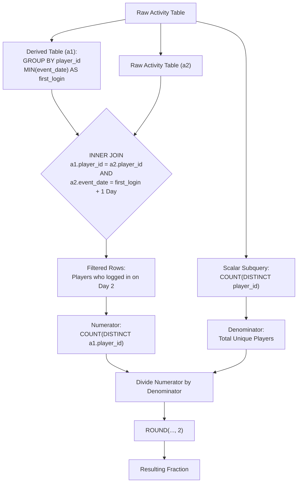

<h2><a href="https://leetcode.com/problems/game-play-analysis-iv">550. Game Play Analysis IV</a></h2>

<p>Table: <code>Activity</code></p>

<pre>+--------------+---------+
| Column Name  | Type    |
+--------------+---------+
| player_id    | int     |
| device_id    | int     |
| event_date   | date    |
| games_played | int     |
+--------------+---------+
(player_id, event_date) is the primary key (combination of columns with unique values) of this table.
This table shows the activity of players of some games.
Each row is a record of a player who logged in and played a number of games (possibly 0) before logging out on someday using some device.
</pre>

<p> </p>

<p>Write a solution to report the <strong>fraction</strong> of players that logged in again on the day after the day they first logged in, <strong>rounded to 2 decimal places</strong>. In other words, you need to determine the number of players who logged in on the day immediately following their initial login, and divide it by the number of total players.</p>

<p>The result format is in the following example.</p>

<p>&nbsp;</p>
<p><strong class="example">Example 1:</strong></p>

<pre><strong>Input:</strong> 
Activity table:
+-----------+-----------+------------+--------------+
| player_id | device_id | event_date | games_played |
+-----------+-----------+------------+--------------+
| 1         | 2         | 2016-03-01 | 5            |
| 1         | 2         | 2016-03-02 | 6            |
| 2         | 3         | 2017-06-25 | 1            |
| 3         | 1         | 2016-03-02 | 0            |
| 3         | 4         | 2018-07-03 | 5            |
+-----------+-----------+------------+--------------+
<strong>Output:</strong> 
+-----------+
| fraction  |
+-----------+
| 0.33      |
+-----------+
<strong>Explanation:</strong> 
Only the player with id 1 logged back in after the first day he had logged in so the answer is 1/3 = 0.33
</pre>


---

# 🛍️ Game-Play-Analysis-IV | Explained

## Approach 1: Subquery First-Login Aggregation with Inner Self-Join

### Intuition
Imagine a mobile game studio analyzing user retention. To measure Day-1 retention, the team doesn't just check if a user logged in two days in a row at any point in time; they specifically want to check if a player returned **on the exact day after their very first login date**. 

To solve this:
1. Identify the baseline "birth date" (first-ever login date) for every unique player.
2. Cross-reference this baseline against the full activity log to see if an entry exists for that player on `first_login + 1 day`.
3. Count how many distinct players met this criteria and divide it by the total count of distinct players in the entire system.

### Algorithm Visualized



### Approach
1. **Find First Login Dates (Subquery `a1`)**: Group the `activity` table by `player_id` and compute `MIN(event_date)` to isolate each player's initial login date.
2. **Join with Raw Logs (`a2`)**: Perform an `INNER JOIN` between the derived table `a1` and the original `activity` table `a2`. Match on `player_id` where `a2.event_date` is exactly 1 day after `a1.first_login` using `DATE_ADD(a1.first_login, INTERVAL 1 DAY)`.
3. **Calculate Numerator**: Count the distinct `player_id` values from the joined result (`COUNT(DISTINCT a1.player_id)`).
4. **Calculate Denominator**: Execute an independent scalar subquery to find the total count of distinct players across the dataset (`SELECT COUNT(DISTINCT player_id) FROM activity`).
5. **Compute & Format Fraction**: Divide the numerator by the denominator and wrap the expression in `ROUND(..., 2)` to get the final decimal retention rate rounded to two places.

### Detailed Code Analysis

* **Lines 2-7**: 
  ```sql
  SELECT 
      ROUND(
          COUNT(DISTINCT a1.player_id) / 
          (SELECT COUNT(DISTINCT player_id) FROM activity) 
      ,2) 
      AS fraction
  ```
  Here, we construct the final target metric `fraction`. `COUNT(DISTINCT a1.player_id)` serves as the **numerator**—counting only players who successfully joined on day 2. The subquery `(SELECT COUNT(DISTINCT player_id) FROM activity)` serves as the **denominator**, fetching the overall player cohort size. `ROUND(..., 2)` ensures compliance with the problem constraint requiring two decimal places.

* **Lines 9-11**: 
  ```sql
  (SELECT player_id, MIN(event_date) AS first_login
  FROM activity
  GROUP BY player_id) a1
  ```
  This derived table `a1` aggregates the data per player. By applying `MIN(event_date)`, we filter out all subsequent logins, isolating solely the registration/first-login event (`first_login`) for each user.

* **Lines 12-14**: 
  ```sql
  JOIN activity a2
      ON a1.player_id=a2.player_id
      AND a2.event_date=DATE_ADD(a1.first_login, INTERVAL 1 DAY)
  ```
  We perform an `INNER JOIN` against `activity` alias `a2`. 
  - `a1.player_id = a2.player_id` ensures we match rows belonging to the exact same user.
  - `a2.event_date = DATE_ADD(a1.first_login, INTERVAL 1 DAY)` uses MySQL's native `DATE_ADD` function to check if an activity record exists on the day immediately following `first_login`. If a player did not log in on `first_login + 1 day`, the `INNER JOIN` drops them from the resulting dataset.

### Code

```sql
# Write your MySQL query statement below
SELECT 
    ROUND(
        COUNT(DISTINCT a1.player_id) / 
        (SELECT COUNT(DISTINCT player_id) FROM activity) 
    ,2) 
    AS fraction
FROM 
    (SELECT player_id, MIN(event_date) AS first_login
    FROM activity
    GROUP BY player_id) a1
JOIN activity a2
    ON a1.player_id=a2.player_id
    AND a2.event_date=DATE_ADD(a1.first_login, INTERVAL 1 DAY)
```

### Complexity

- **Time Complexity:** 
  - **Subquery `a1`**: $\mathcal{O}(N \log N)$ or $\mathcal{O}(N)$ (where $N$ is the number of rows in `activity`) to perform `GROUP BY` and compute `MIN(event_date)`.
  - **JOIN Operation**: If `(player_id, event_date)` is indexed, looking up `DATE_ADD(...)` takes $\mathcal{O}(U \log N)$ where $U$ is the number of unique players. Without indexes, it requires a full table scan taking $\mathcal{O}(U \times N)$ or a hash join taking $\mathcal{O}(N)$.
  - **Scalar Subquery**: $\mathcal{O}(N)$ to count distinct players across the full table (or $\mathcal{O}(U)$ with index scanning).
  - **Overall Time Complexity**: $\mathcal{O}(N)$ with proper indexes on `(player_id, event_date)`; $\mathcal{O}(N \log N)$ in standard database execution engines.

- **Space Complexity:** $\mathcal{O}(U)$, where $U$ is the number of unique players in the dataset. The RDBMS needs to allocate temporary memory space to build the intermediate hash table / derived table `a1` storing one record per unique user.

---

## 🕵️‍♂️ Follow-up Questions (Optional)

### 1. How would you optimize this query for massive datasets (e.g., billions of records in Snowflake/BigQuery)?
**Answer:** Self-joins on multi-billion row tables are computationally expensive. Instead of joining the table back onto itself, use Window Functions (`MIN() OVER()` or `LEAD()`):

```sql
WITH RankedLogins AS (
    SELECT 
        player_id,
        event_date,
        MIN(event_date) OVER(PARTITION BY player_id) AS first_login
    FROM activity
)
SELECT 
    ROUND(
        COUNT(DISTINCT CASE WHEN event_date = DATE_ADD(first_login, INTERVAL 1 DAY) THEN player_id END) 
        / COUNT(DISTINCT player_id), 
        2
    ) AS fraction
FROM RankedLogins;
```
This requires only a **single pass** over the dataset without any heavy table join operations.

### 2. How would you handle timezones if `event_date` were a `TIMESTAMP` column instead of a `DATE`?
**Answer:** `DATE_ADD` on timestamp data will compare exact 24-hour offsets rather than calendar days. You must cast or convert timestamps to standard dates in the user's local timezone (using `CONVERT_TZ()` or `CAST(timestamp AS DATE)`) *before* performing the `MIN()` aggregation and `DATE_ADD()` interval matching.